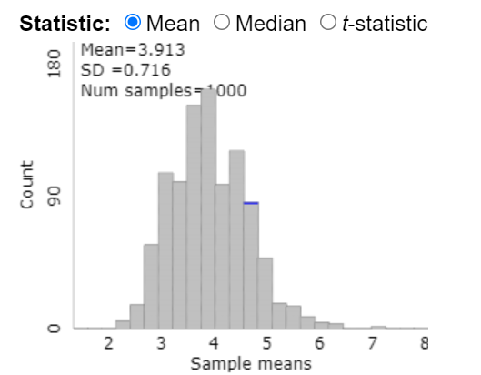

---
output:
  pdf_document: default
  html_document: default
---
## Activity 2: American Indian Address

\setstretch{1}

### Learning outcomes

* Explain why a sampling method is unbiased or biased.

* Identify biased sampling methods.

* Explain the purpose of random selection and its effect on generalization.

### Terminology review

In this activity, we will examine unbiased and biased methods of sampling. Some terms covered in this activity are:

* Random sample

* Unbiased vs biased methods of selection

* Generalization

To review these concepts, see Chapter 2 in the textbook. 

### Class Preparation

Prior to the next class, complete questions 1--3.

### American Indian Address {-}

For this activity, you will read a speech given by Jim Becenti, a member of the Navajo American Indian tribe, who spoke about the employment problems his people faced at an Office of Indian Affairs meeting in Phoenix, Arizona, on January 30, 1947 [@becentispeech]. His speech is below:

**It is hard for us to go outside the reservation where we meet strangers. I have been off the reservation ever since I was sixteen. Today I am sorry I quit the Santa Fe [Railroad]. I worked for them in 1912--13. You are enjoying life, liberty, and happiness on the soil the American Indian had, so it is your responsibility to give us a hand, brother. Take us out of distress. I have never been to vocational school. I have very little education. I look at the white man who is a skilled laborer. When I was a young man I worked for a man in Gallup as a carpenter’s helper. He treated me as his own brother. I used his tools. Then he took his tools and gave me a list of tools I should buy and I started carpentering just from what I had seen. We have no alphabetical language.**

**We see things with our eyes and can always remember it. I urge that we help my people to progress in skilled labor as well as common labor. The hope of my people is to change our ways and means in certain directions, so they can help you someday as taxpayers. If not, as you are going now, you will be burdened the rest of your life. The hope of my people is that you will continue to help so that we will be all over the United States and have a hand with you, and give us a brotherly hand so we will be happy as you are. Our reservation is awful small. We did not know the capacity of the range until the white man come and say “you raise too much sheep, got to go somewhere else,” resulting in reduction to a skeleton where the Indians can’t make a living on it. For eighty years we have been confused by the general public, and what is the condition of the Navajo today? Starvation! We are starving for education. Education is the main thing and the only thing that is going to make us able to compete with you great men here talking to us.**


#### By eye selection {-}

1. Circle ten words in Jim Becenti's speech which are a representative sample of the length of words in the entire text.  Describe your method for selecting this sample.

\vspace{0.7in}

2. Fill in the table below with your selected words from the previous question and the length of each word (number of letters/digits in the word):
\vspace{1mm}

\begin{center}
\begin{tabular}{|l|p{3in}|p{1in}|} \hline
Observation & Word & Length  \\ \hline
1 & & \\ 
& & \\ \hline
2 & & \\ 
& & \\ \hline
3 & & \\ 
& & \\ \hline
4 & & \\ 
& & \\ \hline
5 & & \\ 
& & \\ \hline
6 & & \\ 
& & \\ \hline
7 & & \\
& & \\ \hline
8 & & \\ 
& & \\ \hline
9 & & \\ 
& & \\ \hline
10 & & \\ 
& & \\ \hline
\end{tabular}
\end{center}

3.  Calculate the mean (average) word length in your selected sample.  Is this value a parameter or a statistic?   
\vspace{0.3in}

### Notes on sampling {-}

\vspace{5in}

### Class Activity

1.  Report your mean word length from question 3 to your instructor.  Your instructor will create a visualization of the distribution of results generated by your class. Draw a picture of the plot here. Include a descriptive $x$-axis label.  Report the mean and standard deviation of the sample mean word lengths.

\vspace{2in}

<!-- A dot plot and summary statistics of the "by-eye" average word lengths from by-eye samples of size 10 from a Spring 2023 class with 82 students is provided.    -->

<!-- ```{r} -->
<!-- words <- read.csv("data/Activity2AWordLength_Section004_Sp23.csv") %>% -->
<!--     na.omit() -->

<!-- words %>% -->
<!--     summarise(favstats(Letters)) -->
<!-- words%>% -->
<!--     ggplot(aes(x = Letters))+ -->
<!--     geom_dotplot()+ -->
<!--     labs(title = "Sampling Distribution of Average Word Length",  -->
<!--          x = "Average word length", -->
<!--          y = "Frequency") + -->
<!--     theme_bw() -->

<!-- ``` -->

\newpage


The plot created in question 1 is a sampling distribution of statistics.  This sampling distribution plots the mean word length from many samples taken from the population of words. 

2. The true mean word length of the population of all 359 words in the speech is 3.95 letters. Is this value a parameter or a statistic?   
\vspace{0.2in}

    Where does the value of 3.95 fall in the plot given? Near the center of the distribution? In the tails of the distribution?
\vspace{0.3in}

3.  Would you say the sampling method used ("by-eye" selection) by the class is biased or unbiased?  Justify your answer.  
\vspace{0.5in}

4.  If the sampling method is biased, what type of sampling bias (selection, response, non-response) is present?  What is the direction of the bias, i.e., does the method tend to overestimate or underestimate the population mean word length?
\vspace{0.5in}

#### Random selection {-}

Suppose instead of attempting to select a representative sample by eye (which did not work), each student used a random number generator to select a simple random sample of 10 words. A **simple random sample** relies on a random mechanism to choose a sample, without replacement, from the population, such that every sample of size 10 is equally likely to be chosen.

Later in the semester we will learn more about how to use R - for today we will have a short introduction using the `R` studio server.  Download the provided R script file from canvas.  

5. Login to the R studio server using your netID login.  Upload the file to the server using the following instructions.  

* Click "Upload" in the "Files" tab in the bottom right window of RStudio. In the pop-up window, click "Choose File", and navigate to the folder where the Activity R script file is saved (most likely in your downloads folder). Click "Open"; then click "Ok". 

* Once the file is uploaded, you should see the uploaded file appear in the list of files in the bottom right window. Click on the R script file name to open the file in the Editor window (upper left window).  

The following code will take a random sample of 10 words from the population of 359 words.  

* In the R script file, highlight and run lines 1--7 

```{r}
words <- read.csv("https://www.math.montana.edu/courses/s216/data/Becenti.csv")
```

```{r, eval=FALSE, echo=TRUE}
sample(words$Word, 10)
```

<!-- To use a random number generator to select a simple random sample, you first need a numbered list of all the words in the population, called a **sampling frame**. You can then generate 10 random numbers from the numbers 1 to 359 (the number of words in the population), and the chosen random numbers correspond to the chosen words in your sample. -->

<!-- 5. Use the random number generator at https://istats.shinyapps.io/RandomNumbers/ to select a simple random sample from the population of all 359 words in the speech.  -->

<!-- * Set "Choose Minimum" to 1 and "Choose Maximum" to 359 to represent the 359 words in the population (the sampling frame). -->

<!-- * Set "How many numbers do you want to generate?" to 10 and ensure the "No" option is selected under "Sample with Replacement?"  -->

<!-- * Click "Generate". -->

\newpage

Fill in the table with the random words selected and calculate the word length (number of letters/digits in the word):

\begin{center}
\begin{tabular}{|p{2.5in}|p{1in}|} \hline
Word  & Length  \\ \hline
 & \\ 
 & \\ \hline
 & \\ 
 & \\ \hline
 & \\ 
 & \\ \hline
 & \\ 
 & \\ \hline
 & \\ 
 & \\ \hline
 & \\ 
 & \\ \hline
 & \\
 & \\ \hline
 & \\ 
 & \\ \hline
 & \\ 
 & \\ \hline
 & \\ 
 & \\ \hline
\end{tabular}
\end{center}

6. Calculate the mean word length in your selected sample above. Is this value a parameter or a statistic?
\vspace{0.3in}

7. Report your mean word length as instructed.  Your instructor will create a visualization of the distribution of results generated by your class. Draw a picture of the plot here. Include a descriptive $x$-axis label.  Report the mean and standard deviation of the samples.

\vspace{2.5in}

<!-- A dot plot and summary statistics of the average word lengths from random samples of size 10 from a Spring 2023 class of 82 students is provided. -->

<!-- ```{r} -->
<!-- words<-data.frame(c(3.7, 4.6, 4, 3.9, 3.7, 4.7, 4.9, 4.5, 3.6, 3.5, 3.9, 3.6, 3.1, 4.2, 3.9, 5.1,  -->
<!--                     3.1, 3.8, 4, 3.2, 5.1, 3.5, 4.9, 3.9, 4.6, 3.5, 3.5, 4.3, 4.1, 5, 3.7, 3.8,  -->
<!--                     3.7, 3.6, 3.2, 4.1, 4.4, 4.5, 3.0, 3.7, 3.7, 4.1, 4.3, 3.9, 3.1, 3.1, 4.4, 3.2,  -->
<!--                     4.5, 2.5, 3.7, 4.5, 3.8, 3.3, 3.6, 4.3, 2.9, 3.6, 4.2, 2.8, 5.5, 4.6, 5.3, 4.9, 3.9,  -->
<!--                     3.8, 3.8, 4.2, 4.3, 2.5, 3.1, 3.5, 3.7, 3.3, 5.7, 4.2, 3.3, 3.2, 2.8, 5.2, 4.1, 4.5)) -->
<!-- colnames(words)<-c("letters") -->

<!-- words%>% -->
<!--     ggplot(aes(x = letters))+ -->
<!--     geom_dotplot()+ -->
<!--     labs(title = "Sampling Distribution of Average Word Length",  -->
<!--          x = "Average word length", -->
<!--          y = "Frequency") + -->
<!--     theme_bw() -->

<!-- words %>% -->
<!--   summarise(favstats(letters)) -->
<!-- ``` -->

<!-- 8.  Where does the value 3.95, the true mean word length, fall in the distribution given? Near the center of the distribution?  In the tails of the distribution?  Circle this value on the provided distribution. -->
<!-- \vspace{0.3in} -->

One set of randomly generated sample mean word lengths from a single class may not be large enough to visualize the distribution results. 

<!-- *  Navigate to the “One Variable with Sampling” Rossman/Chance web applet: http://www.rossmanchance.com/applets/2021/sampling/OneSample.html?population=gettysburg. -->

<!-- *  Click "Clear" below the text box containing data from the Gettysburg address to delete that data set. -->

<!-- *  Download the Becenti.csv file from Canvas and open the spreadsheet on your computer. -->

<!-- *  Copy and paste the population of word lengths (column C) into the applet from the data set provided making sure to include the header.  Click "Use Data".  Verify that the mean for the data set is 3.953 with a sample size of 359.  If these are not the values you got, check with your instructor for help with copying in the data set correctly. -->

<!-- *  Click the check-box for "Show Sampling Options" -->

<!-- *  Select 1000 for "Number of samples" and select 10 for the "Sample size".   -->

<!-- *  Click “Draw Samples”. -->

<!-- 6. The plot labeled “Statistics” displays the 1,000 randomly generated sample mean word lengths (the sampling distribution). Sketch this plot below. Include a descriptive $x$-axis label and be sure to write down the provided mean and SD (standard deviation) of the distribution. -->
<!-- \vspace{2in} -->


<!-- The following plot illustrates a sampling distribution of 1000 samples of size 10 selected at random from the sample.   -->

<!-- ```{r, fig.align = "center", out.width="75%"} -->
<!--  -->
<!-- ``` -->

\newpage 

The following is a plot of 1000 random samples of size 10 created in `R`.  To re-create this plot run lines 11--28 in the `R` script file.

```{r, out.width="65%"}
true_mean <- mean(words$Length)
set.seed(216)
srs_means <- replicate(1000, {
  words %>%
    slice_sample(n = 10) %>%
    summarize(mean_length = mean(Length)) %>%
    pull()
})

tibble(mean_length = srs_means) %>%
  ggplot(aes(x = mean_length)) +
  geom_histogram(bins = 30) +
  geom_vline(xintercept = true_mean, linetype = "dashed") +
  labs(
    title = "Sampling Distribution of the Mean Word Length",
    subtitle = "Dashed line shows the true population mean",
    x = "Sample mean word length (letters)",
    y = "Count"
  )
```

It would be useful to know what the center (mean) is for this sampling distribution.  The distribution you created in the `R` script file may vary a little from what is reported in your coursepack. To find the mean and standard deviation from your distribution run lines 32--33.

```{r, echo=TRUE}
mean(srs_means)
sd(srs_means)
```

8. Would you say this sampling method used (random selection) is biased or unbiased?  Justify your answer.  
\vspace{0.5in}

The following two plots show the sampling distribution of  convenience samples of size 10 from the population of word length (top) and the simple random sample created above (bottom).
```{r, echo=FALSE}
set.seed(216)
convenience_means <- replicate(1000, {
  words %>%
    mutate(prob = scales::rescale(Length, to = c(0.2, 1))) %>%
    slice_sample(n = 10, weight_by = prob) %>%
    summarize(mean_Length = mean(Length)) %>%
    pull()
})

tibble(
  mean_Length = c(srs_means, convenience_means),
  method = rep(c("Simple Random Sample", "Convenience Sample"), each = 1000)
) %>%
  ggplot(aes(x = mean_Length)) +
  geom_histogram(bins = 30) +
  facet_wrap(~ method, ncol = 1) +
  geom_vline(xintercept = true_mean, linetype = "dashed") +
  labs(
    title = "Sampling Distributions of the Mean Word Length",
    subtitle = "Dashed line shows the true population mean",
    x = "Sample mean word length (letters)",
    y = "Count")

```

The mean and standard deviation for the convenience sample is provided below.

```{r, echo=TRUE}
mean(convenience_means)
sd(convenience_means)
```


9.  Compare the two distributions shown above.  What is similar between the two distributions?  What is different?

\vspace{0.8in}

10. Using the plots above, explain why using a random number generator to generate a sample is a "better" method than choosing 10 words “by eye” (convenience sample).
\vspace{0.8in}

11.  Is random selection an unbiased method of selection?  Explain your answer. Be sure to reference the created plots.
\vspace{0.5in}

Later in the semester we will learn about the Scope of Inference for a study.  A diagram of Scope of Inference is show below:

```{r, fig.align = "center", out.width="75%"}
include_graphics("images/ScopeOfInferenceGreyscale.png")
```
In this activity we have focused on sampling methods.  Note that the sampling method used to select the sample determines the group of observation units the results of a study apply to. This is "generalization."  We will explore causation in Module 8.

12. What is the purpose of random selection of a sample from the population?

\vspace{0.8in}


### Take-home messages

1.	When we use a biased method of selection, we will over or underestimate the parameter, on average.

2. If the sampling method is biased, inferences made about the population based on a sample estimate will not be valid.

3. Random selection is an unbiased method of selection.

4. To determine if a sampling method is biased or unbiased, we compare the distribution of the estimates to the true value. We want our estimate to be on target or unbiased.  When using unbiased methods of selection, the mean of the distribution matches or is very similar to our true parameter.

5. Random selection eliminates selection bias.  However, random selection will not eliminate response or non-response bias.


### Additional notes

Use this space to summarize your thoughts and take additional notes on today's activity and material covered.

\newpage