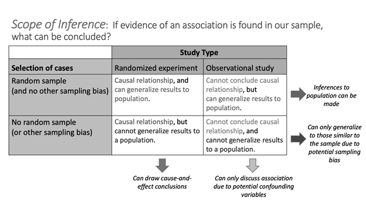

# Study Design

## Lecture Notes Week 2: Study Design

\setstretch{1}

### Sampling Methods: Section 2.1 in the course textbook {-}

\setstretch{1.5}

The method used to collect data will impact 

* Target population: all _______________ or ______________ of interest 

* Sample:________________ or ________________ from which data is collected

\setstretch{1}

Example: Many high schools moved to partial or fully online schooling in Spring of 2020. Did students who graduated in 2020 tend to have a lower GPA during freshman year of college than the previous class of college freshmen? A nationally representative sample of 1000 college students who were freshmen in AY19-20 and 1000 college students who were freshmen in AY20-21 was taken to answer this question.

* What is the target population?

\vspace{0.2in}

* What is the sample?

\vspace{0.2in}

#### Good vs. bad sampling {-}

\setstretch{1.5}

GOAL: to have a sample that is _______________ of the
______________ _______________ on the variable(s) of interest

\setstretch{1}

* Unbiased sample methods:

\vspace{0.5in}

\rgi \rgi Simple random sample

* Biased sampling method: 

\vspace{0.5in}

### Types of Sampling Bias {-}

* Selection bias: 

\vspace{0.5in}

\newpage

Example: Newspaper article from 1936 reported that Landon won the presidential election over Roosevelt based on a poll of 10 million voters. Roosevelt was the actual winner.  What was wrong with this poll?  Poll was completed using a telephone survey and not all people in 1936 had a telephone.  Only a certain subset of the population owned a telephone so this subset was over-represented in the telephone survey. The results of the study, showing that Landon would win, did not represent the target population of all US voters.

* Non-response bias:  

\vspace{0.5in}

* To calculate the non-response rate: 
    
$$\frac{\text{number of people who do not respond}}{\text{total number of people selected for the sample}}\times 100\%$$
 
* For non-response bias to occur must first select people to participate and then they choose not to.
    

Example:  A company randomly selects buyers to complete a review of an online purchase but some choose not to respond. 
    
* Response bias:

\vspace{0.5in}

Example(s): Police officer pulls you over and asks if you have been drinking.  Expect people to say no, whether they have been drinking or not.  
    
* Need to be able to predict how people will respond.
    
Words of caution:

* Convenience samples: gathering data for those who are easily
accessible; online polls

\setstretch{1.5}

\rgi \rgi Selection bias? 
    
\rgi \rgi Non-response bias?  
    
\rgi \rgi Response bias? 

* Random sampling reduces _________________ bias, but 
has no impact on ________________ or ______________ bias.

\setstretch{1}

#### Examples for class discussion {-}

A radio talk show asks people to phone in their views on whether the United States should pay off its debt to the United Nations.

* Selection?

\vspace{0.25in}

* Non-response?

\vspace{0.25in}

* Response?

\vspace{0.25in}

The Wall Street Journal plans to make a prediction for the US presidential election based on a survey of its readers and plans to follow-up to ensure everyone responds.

* Selection?

\vspace{0.25in}

* Non-response?

\vspace{0.25in}

* Response?

\vspace{0.25in}
    
A police detective interested in determining the extent of drug use by high school students, randomly selects a sample of high school students and interviews each one about any illegal drug use by the student during the past year.

* Selection?

\vspace{0.25in}

* Non-response?

\vspace{0.25in}

* Response?

\vspace{0.25in}
    
### Observational studies, experiments, and scope of inference: Sections 2.2 -- 2.4 in the course textbook {-}

* Review

    - Explanatory variable: the variable researchers think *may be* effecting the other variable.
    
    - Response variable: the variable researchers think *may be* influenced by the other variable.

* Confounding variable: 
    - associated with both the explanatory and the response variable
    - explains the association shown by the data 

Example: 

\vspace{0.8in}

#### Study design {-}

* Observational study: 

\vspace{0.5in}

* Experiment: 

\vspace{0.5in}

Principles of experimental design

* Control: hold other differences constant across groups
\vspace{0.1in}

* Randomization: randomized experiment
\vspace{0.1in}

* Replication: large sample size or repeat of study
\vspace{0.1in}

* Blocking: group based on certain characteristics

\vspace{0.1in}
    

Example: It is well known that humans have more difficulty differentiating between faces of people from different races than people within their own race. A 2018 study published in the Journal of Experimental Psychology [@levin2000]: Human Perception and Performance investigated a similar phenomenon with gender. In the study, volunteers were shown several pictures of strangers. Half the volunteers were randomly assigned to rate the attractiveness of the individuals pictured. The other half were told to rate the distinctiveness of the faces seen. Both groups were then shown a slideshow of faces (some that had been rated in the first part of the study, some that were new to the volunteer) and asked to determine if each face was old or new. Researchers found people were better able to recognize faces of their own gender when asked to rate the distinctiveness of the faces, compared to when asked to rate the attractiveness of the faces.

* What is the study design?
    
\vspace{0.5in}


Example: In the Physician's Health Study [@physhealth], male physicians participated in a study to determine whether taking a daily low-dose aspirin reduced the risk of heart attacks. The male physicians were randomly assigned to the treatment groups. After five years, 104 of the 11,037 male physicians taking a daily low-dose aspirin had experienced a heart attack while 189 of the 11,034 male physicians taking a placebo had experienced a heart attack. 

* What is the study design?
    
\vspace{0.5in}

* Assuming these data provide evidence that the low-dose aspirin group had a lower rate of heart attacks than the placebo group, is it valid for the researchers to conclude the lower rate of heart attacks was caused by the daily low-dose aspirin regimen?

\vspace{0.5in}
    
#### Scope of Inference {-}

1. How was the sample selected?

* Random sample with no sampling bias:

\vspace{0.35in}

* Non-random sample with sampling bias:

\vspace{0.35in}

\newpage

2. What is the study design?

* Randomized experiment:
    
\vspace{0.35in}

* Observational study:
    
\vspace{0.35in}

Scope of Inference Table:

```{r, fig.align = "center", out.width="75%"}

```

Example: It is well known that humans have more difficulty differentiating between faces of people from different races than people within their own race. A 2018 study published in the Journal of Experimental Psychology [@levin2000]: Human Perception and Performance investigated a similar phenomenon with gender. In the study, volunteers were shown several pictures of strangers. Half the volunteers were randomly assigned to rate the attractiveness of the individuals pictured. The other half were told to rate the distinctiveness of the faces seen. Both groups were then shown a slideshow of faces (some that had been rated in the first part of the study, some that were new to the volunteer) and asked to determine if each face was old or new. Researchers found people were better able to recognize faces of their own gender when asked to rate the distinctiveness of the faces, compared to when asked to rate the attractiveness of the faces.

* What is the scope of inference for this study?

\vspace{0.8in}

Purpose of random assignment:

\vspace{0.8in}

Purpose of random selection:

\newpage
\vspace{0.8in}
