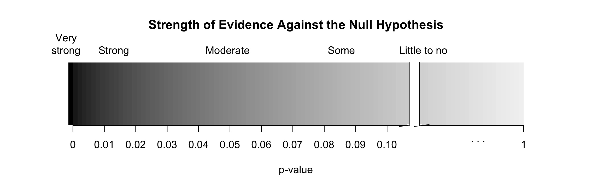

---
output:
  pdf_document: default
  html_document: default
---
## Activity 5:  Helper-Hinderer (continued)

```{r,echo=FALSE}
set.seed(216)
```

\setstretch{1}

### Learning outcomes

* Describe and perform a simulation-based hypothesis test for a single proportion.

* Interpret and evaluate a p-value for a simulation-based hypothesis test for a single proportion.

* Explore what a p-value represents

### Steps of the statistical investigation process

In today's activity we will continue with steps 4 and 5 in the statistical investigation process.  We will continue to assess the Helper-Hinderer study from last class.

* **Ask a research question** that can be addressed by collecting data. What are the researchers trying to show?

* **Design a study and collect data**. This step involves selecting the people or objects to be studied and how to gather relevant data on them.

* **Summarize and visualize the data**. Calculate summary statistics and create graphical plots that best represent the research question.

* **Use statistical analysis methods to draw inferences from the data**. Choose a statistical inference method appropriate for the data and identify the p-value and/or confidence interval after checking assumptions. In this study, we will focus on using randomization to generate a simulated p-value.

* **Communicate the results and answer the research question**. Using the p-value and confidence interval from the analysis, determine whether the data provide statistical evidence against the null hypothesis. Write a conclusion that addresses the research question.

### Helper-Hinderer

In class today, we will revisit the study on infants as described below.

A study by Hamblin, Wynn, and Bloom reported in Nature [@hamblin2007] was intended to check young kids' feelings about helpful and non-helpful behavior. Non-verbal infants ages 6 to 10 months were shown short videos with different shapes either helping or hindering the climber. As a class we will watch this short video to see how the experiment was run: https://youtu.be/anCaGBsBOxM. Researchers were hoping to assess: Are non-verbal infants more likely to choose the helper toy? In the study, of the 16 infants age 6 to 10 months, 14 chose the *helper* toy and 2 chose the *hinderer* toy.


Today, we will use the computer to simulate a null distribution of 10000 different samples of 16 infants, plotting the proportion who chose the helper in each sample, based on the assumption that the true proportion of infants who choose the helper is 0.5 (or that the null hypothesis is true).  

To use the computer simulation, we will need to enter the 

* assumed "probability of success" ($\pi_0$), 
* "sample size" (the number of observational units or cases in the sample),
* "number of repetitions" (the number of samples to be generated - typically we use 10000), 
* "as extreme as" (the observed statistic), and 
* the "direction" (matches the direction of the alternative hypothesis).


1.  What values should be entered for each of the following into the one proportion test to create 10000 simulations?

\vspace{1mm}
* Probability of success (null value):

\vspace{.2in}
* Sample size (n):
    
\vspace{.2in}
* Number of repetitions (typically use 10000 simulations):
    
\vspace{.2in}
* As extreme as (value of statistic):
    
\vspace{.2in}
* Direction (`"greater"`, `"less"`, or `"two-sided"`):

We will use the `one_proportion_test()` function in R (in the `catstats` package) to simulate the null distribution of sample proportions and compute a p-value. Using the provided `R` script file, fill in the values/words for each `xx` with your answers from question 3 in the one proportion test to create a null distribution with 10000 simulations. Then highlight and run lines 1--16.

```{r, echo=TRUE, eval = TRUE}
one_proportion_test(probability_success = 0.5, # Null hypothesis value
          sample_size = 16, # Enter sample size
          number_repetitions = 10000, # Enter number of simulations
          as_extreme_as = 0.875, # Observed statistic
          direction = "greater", # Specify direction of alternative hypothesis
          summary_measure = "proportion") # Reporting proportion or number of successes?
```

### Notes on the null distribution {-}

\vspace{1.25in}

2. Circle the observed statistic (value from question 1) on the null distribution.  Where does this statistic fall in the null distribution: Is it near the center of the distribution (near 0.5) or in one of the tails of the distribution?  

\vspace{0.3in}

3. Is the observed statistic likely to happen or unlikely to happen if the true proportion of infants who choose the helper is 0.5?  Explain your answer using the plot.

\vspace{0.5in}

4.  Using the simulation, what is the proportion of simulated samples that generated a sample proportion at the observed statistic or greater, if the true proportion of infants who choose the helper is 0.5? *Hint*: Look under the simulation.

\vspace{0.3in}

### Notes on the p-value {-}

The value in question 4 is the **p-value**.  The smaller the p-value, the more evidence we have against the null hypothesis. 

\vspace{1.5in}


```{r, out.width="90%"}

```


#### Interpret the p-value {-}

The p-value measures the probability that we observe a sample proportion as extreme as what was seen in the data or more extreme (matching the direction of the $H_A$) IF the null hypothesis is true.  This is a conditional probability, calculated dependent on the null hypothesis being true.  Represented in probability notation:

$$P(\text{statistic or more extreme|the null hypothesis is true})$$

**p-value interpretation:**

\vspace{1in}

#### Communicate the results and answer the research question {-}

When we write a conclusion we answer the research question by stating how much evidence there is in support of the alternative hypothesis.

**Conclusion:**

\vspace{1in}

#### Generalization {-}

5. To what group of observational units can the results be generalized to?

\vspace{0.5in}

#### Impacts on the p-value {-}

Let's see how each of the following with change the p-value.

In another sample of 16 infants, only 10 selected the helper toy.  The null distribution created below reflects this new sample.

```{r, echo=TRUE, eval = TRUE}
one_proportion_test(probability_success = 0.5, # Null hypothesis value
          sample_size = 16, # Enter sample size
          number_repetitions = 10000, # Enter number of simulations
          as_extreme_as = 0.625, # Observed statistic
          direction = "greater", # Specify direction of alternative hypothesis
          summary_measure = "proportion") # Reporting proportion or number of successes?
```
6.  Note that this statistic ($\frac{10}{16} = 0.625$) is closer to the null value of 0.5 than the original statistic ($\frac{14}{16}=0.875$). Is the p-value for this new study larger or smaller than for the original statistic?

\vspace{0.3in}

In still another study, the researchers took a sample of 32 infants and from this study found that 28 selected the helper toy ($\hat{p} = \frac{28}{32}= 0.875$).  The null distribution created below reflects this new study.

```{r, echo=TRUE, eval = TRUE}
one_proportion_test(probability_success = 0.5, # Null hypothesis value
          sample_size = 32, # Enter sample size
          number_repetitions = 10000, # Enter number of simulations
          as_extreme_as = 0.875, # Observed statistic
          direction = "greater", # Specify direction of alternative hypothesis
          summary_measure = "proportion") # Reporting proportion or number of successes?
```
7.  Is the p-value found for the larger sample size ($n=32$) larger or smaller than the p-value found with the smaller sample size ($n=16$).

\vspace{0.3in}

8.  Summarize how each of the following affected the p-value: 

a) Using a larger sample size.

\vspace{0.4in}

b) Using a sample statistic closer to the null value.

\vspace{0.4in}


### Take-home messages

1. The null distribution is created based on the assumption the null hypothesis is true. We compare the sample statistic to the distribution to find the likelihood of observing this statistic.

2. The p-value measures the probability of observing the sample statistic or more extreme (in direction of the alternative hypothesis) is the null hypothesis is true.

3. The smaller the p-value of the test, the more evidence there is **against** the null hypothesis.

4.  The larger the sample size, the smaller the sample to sample variability.  This will result in a larger standardized statistic and more evidence against the null hypothesis.

5.  The farther the statistic is from the null value, the larger the standardized statistic.  This will result in a smaller p-value and more evidence against the null hypothesis.

### Additional notes

Use this space to summarize your thoughts and take additional notes on today's activity and material covered.

\newpage
