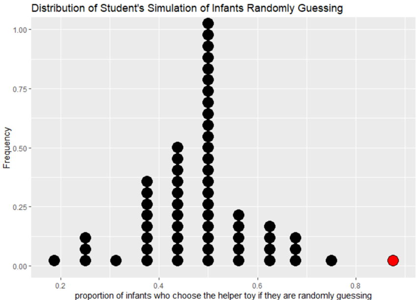

## Activity 6:  Helper-Hinderer Part 1 --- Simulation-based Hypothesis Test

\setstretch{1}

### Learning outcomes

* Identify the two possible explanations (one assuming the null hypothesis and one assuming the alternative hypothesis) for a relationship seen in sample data.

* Given a research question involving a single categorical variable, construct the null and alternative hypotheses
  in words and using appropriate statistical symbols.
  
* Describe and perform a simulation-based hypothesis test for a single proportion.

### Terminology review

In today's activity, we will work through a simulation-based hypothesis testing for a single categorical variable. Some terms covered in this activity are:

* Parameter of interest

* Null hypothesis

* Alternative hypothesis

* Simulation

To review these concepts, see Chapters 9 & 14 in your textbook.

### Steps of the statistical investigation process

We will work through a five-step process to complete a hypothesis test for a single proportion, first introduced in the activity in week 1.

* **Ask a research question** that can be addressed by collecting data. What are the researchers trying to show?

* **Design a study and collect data**. This step involves selecting the people or objects to be studied and how to gather relevant data on them.

* **Summarize and visualize the data**. Calculate summary statistics and create graphical plots that best represent the research question.

* **Use statistical analysis methods to draw inferences from the data**. Choose a statistical inference method appropriate for the data and identify the p-value and/or confidence interval after checking assumptions. In this study, we will focus on using randomization to generate a simulated p-value.

* **Communicate the results and answer the research question**. Using the p-value and confidence interval from the analysis, determine whether the data provide statistical evidence against the null hypothesis. Write a conclusion that addresses the research question.

\newpage

### Helper-Hinderer

A study by Hamblin, Wynn, and Bloom reported in Nature [@hamblin2007] was intended to check young kids' feelings about helpful and non-helpful behavior. Non-verbal infants ages 6 to 10 months were shown short videos with different shapes either helping or hindering the climber. As a class we will watch this short video to see how the experiment was run: https://youtu.be/anCaGBsBOxM. Researchers were hoping to assess: Are infants more likely to choose the helper toy over the hinderer toy?  In the study, of the 16 infants age 6 to 10 months, 14 chose the *helper* toy and 2 chose the *hinderer* toy.


In this study, the **observational units are the infants ages 6 to 10 months**.  The **variable measured on each observational unit (infant) is whether they chose the helper or the hinderer toy**.  This is a categorical variable so we will be assessing the proportion of infants ages 6 to 10 months that choose the helper toy.  Choosing the helper toy in this study will be considered a success.

#### Ask a research question {-}

1. Identify the research question for this study.  What are the researchers hoping to show?

\vspace{0.6in}

#### Design a study and collect data {-}

Before using statistical inference methods, we must check that the cases are independent.  The sample observations are independent if the outcome of one observation does not influence the outcome of another. One way this condition is met is if data come from a simple random sample of the target population.

2.  Are the cases independent? Justify your answer.

\vspace{0.8in}


#### R code {-}

For almost all activities and labs it will be necessary to upload the provided R script file from D2L for that day.  Your instructor will highlight a few steps in uploading files to and using RStudio.  

The following are the steps to upload the necessary R script file for this activity: 

* Download the Activity R script file from D2L.

* Click "Upload" in the "Files" tab in the bottom right window of RStudio. In the pop-up window, click "Choose File", and navigate to the folder where the Activity R script file is saved (most likely in your downloads folder). Click "Open"; then click "Ok". 

* You should see the uploaded file appear in the list of files in the bottom right window. Click on the file name to open the file in the Editor window (upper left window).

Notice that the first threelines of code contain a prompt called `library`.  Packages needed to run functions in R are stored in directories called libraries.  When using the MSU RStudio server, all the packages needed for the class are already installed.  We simply must tell R which packages we need for each R script file.  We use the prompt `library` to load each **package** (or library) needed for each activity. Note, these `library` lines MUST be run each time you open a R script file in order for the functions in R to work. 

* Highlight and run lines 1--3 to load the packages needed for this activity. Notice the use of the \# symbol in the R script file.  This symbol is not part of the R code. It is used by these authors to add comments to the R code and explain what each call is telling the program to do.

R will ignore everything after a \# symbol when executing the code. Refer to the instructions following the \# symbol to understand what you need to enter in the code.

```{r, echo=TRUE, eval=FALSE}
library(tidyverse)
library(ggplot2)
library(catstats)
```

Throughout activities, we will often include the R code you would use in order to produce output or plots. These "code chunks" appear in gray. In the code chunk below, we demonstrate how to read the data set into R using the `read.csv()` function.  The line of code shown below (line 7 in the R script file) reads in the data set and names the data set `infants`.

#### Summarize and visualize the data {-}

The following code reads in the data set and gives the number of infants in each level of the variable, whether the infant chose the helper or the hinderer.    

* Highlight and run lines 7 and 8 to check that you get the same counts as shown below

```{r, echo=TRUE, collapse=FALSE, message=FALSE, warning=FALSE}
 # Read in data set
infants <- read.csv("https://math.montana.edu/courses/s216/data/infantchoice.csv")
infants %>% count(choice)  # Count number in each choice category
```

The following formula is used to calculate the proportion of successes in the sample.

$$\hat{p} = \frac{\mbox{number of successes}}{\mbox{total number of observational units}}$$

3.  Using the R output and the formula given, calculate the summary statistic (sample proportion) to represent the research question.  Recall that `choosing the helper toy` is a considered a success.  Use appropriate notation.

\vspace{0.5in}

To visually display this data we can use either a frequency bar plot or a relative frequency bar plot. 

* Enter the name of the variable name `choice` for `variable` in the R code to create the frequency bar plot.

* Note the name of the title is given in line 16 and includes the type of plot, observational units, and variable name

* Highlight and run lines 13--19 to create the plot

```{r, out.width="50%", echo=TRUE, eval=FALSE}
infants %>% # Data set piped into...
    ggplot(aes(x = variable)) +   # This specifies the variable
    geom_bar(stat = "count") +  # Tell it to make a bar plot
    labs(title = "Frequency Bar Plot of Toy Choice for Pre-verbal Infants",  
       # Give your plot a title
       x = "Toy Choice",   # Label the x axis
       y = "Frequency")  # Label the y axis
```

4. Sketch the frequency bar plot created below.

\vspace{1.8in}

We could also choose to display the data as a proportion in a **relative frequency** bar plot. To find the relative frequency, the count in each level of `choice` is divided by the sample size.  This calculation is the sample proportion for each level of choice. Notice that in the following code we told R to create a bar plot with proportions.  

* In the R script file, highlight and run lines 23--29 to create the relative frequency bar plot.

```{r, out.width="50%", echo=TRUE, eval=TRUE}
infants %>% # Data set piped into...
    ggplot(aes(x = choice)) +   # This specifies the variable
    geom_bar(aes(y = after_stat(prop), group = 1)) +  # Tell it to make a bar plot with proportions
    labs(title = "Relative Frequency Bar Plot of Toy Choice for Pre-verbal Infants",  
       # Give your plot a title
       x = "Toy Choice",   # Label the x axis
       y = "Relative Frequency")  # Label the y axis
```

5.  Which features in the relative frequency bar plot are the same as the frequency bar plot?  Which are different?

\vspace{0.5in}

We cannot assess whether infants are more likely to choose the helper toy based on the statistic and plot alone.  The next step is to analyze the data by using a hypothesis test to discover if there is evidence against the null hypothesis.

#### Use statistical analysis methods to draw inferences from the data {-}

When performing a hypothesis test, we must first identify the null hypothesis.  The null hypothesis is written about the parameter of interest, or the value that summarizes the variable in the population.  

The parameter of interest is a statement about what we want to find about the population.  The following must be included when writing the parameter of interest.

* Population word (true, long-run, population)

* Summary measure (depends on the type of data)

* Context

    - Observational units

    - Variable(s)
        
For this study, the parameter of interest, $\pi$, represents the **true or population proportion of infants ages 6--10 months who will choose the helper toy**.

If the children are just randomly choosing the toy, we would expect half (0.5) of the infants to choose the helper toy.  This is the null value for our study.

6.  Using the parameter of interest given above, write out the null hypothesis in words.  That is, what do we assume to be true about the parameter of interest when we perform our simulation? 
\vspace{0.8in}

The notation used for a population proportion (or probability, or true proportion) is $\pi$.  Since this summarizes a population, it is a parameter. When writing the **null hypothesis** in notation, we set the parameter equal to the null value, $H_0: \pi = \pi_0$.

7. Write the null hypothesis in notation using the null value of 0.5 in place of $\pi_0$ in the equation given on the previous page.

\vspace{0.5in}

The **alternative hypothesis** is the claim to be tested and the direction of the claim (less than, greater than, or not equal to) is based on the research question.  

8.  Based on the research question from question 1, are we testing that the parameter is greater than 0.5, less than 0.5 or different than 0.5? 

\vspace{0.2in}

<!-- 8. Write out the alternative hypothesis in words. -->

9.  Write out the alternative hypothesis in notation.

\vspace{0.5in}

Remember that when utilizing a hypothesis test, we are evaluating two competing possibilities. For this study the **two possibilities** are either...

* The true proportion of infants who choose the helper is 0.5 and our results just occurred by random chance; or,
  
* The true proportion of infants who choose the helper is greater than 0.5 and our results reflect this.
  
Notice that these two competing possibilities represent the null and alternative hypotheses.

We will now simulate one sample of a **null distribution** of sample proportions. The null distribution is created under the assumption the null hypothesis is true.  In this case, we assume the true proportion of infants who choose the helper is 0.5, so we will create 1000 (or more) different simulations of 16 infants under this assumption.

Let's think about how to use a coin to create one simulation of 16 infants under the assumption the null hypothesis is true.  Let heads equal infant chose the helper toy and tails equal infant chose the hinderer toy.

10. How many times would you flip a coin to simulate the sample of infants?

\vspace{0.2in}

11. Flip a coin 16 times recording the number of times the coin lands on heads.  This represents one simulated sample of 16 infants randomly choosing the toy.  Calculate the proportion of coin flips that resulted in heads.

\vspace{0.2in}

12. Is the value from question 9 closer to 0.5, the null value, or closer to the sample proportion, 0.875? 

\vspace{0.2in}

<!-- 11.  How many cards total do we need?  On how many cards will we write **helper**?  On how many cards will we write **hinderer**?  Remember this should represent the null hypothesis. -->

<!-- \vspace{0.5in} -->

<!-- 12.  Next, we would mix the cards together and draw 1 card, write down if the card says helper or hinderer, and replace the card.  How many times would we need to repeat this process to simulate one sample? -->

<!-- \vspace{0.3in} -->

<!-- 13.  Once we have one simulated sample, what would we calculate and plot on the null distribution?  *Hint*: What statistic are we calculating from the data? -->

<!-- \vspace{0.5in} -->

<!-- 14.  Create one simulation using the cards provided.  Write down your simulated sample proportion.  This is one simulation created under the assumption the null hypothesis is true.  Is this value closer to 0.5, the null value, or closer to the sample proportion, 0.875?  Compare your simulated value to the other groups at your table. -->

<!-- \vspace{0.8in} -->

Report the number of coin flips you got in the Google sheet on D2L.  

<!-- The distribution of the proportion of 16 coin flips from a Spring 2023 class is provided below.  -->

<!-- ```{r, out.width="90%"} -->
<!--  -->
<!-- ``` -->

13. Sketch the graph created by your instructor of the proportion of heads out of 16 coin flips.

\vspace{2in}

14. Circle the observed statistic (value from question 3) on the distribution shown above.  Where does this statistic fall in this distribution: Is it near the center of the distribution (near 0.5) or in one of the tails of the distribution?

\vspace{0.2in}

15. Is the observed statistic likely to happen or unlikely to happen if the true proportion of infants who choose the helper is 0.5?  Explain your answer using the plot. 

\vspace{0.8in}

In the next class, we will continue to assess the strength of evidence against the null hypothesis by using a computer to simulate 1000 samples when we assume the null hypothesis is true.


### Take-home messages

1. Two types of plots are used for plotting categorical variables: frequency bar plots, relative frequency bar plots.


2. In a hypothesis test we have two competing hypotheses, the null hypothesis and the alternative hypothesis.  The null hypothesis represents either a skeptical perspective or a perspective of no difference or no effect. The alternative hypothesis represents a new perspective such as the possibility that there has been a change or that there is a treatment effect in an experiment.  

3. In a simulation-based test, we create a distribution of possible simulated statistics for our sample if the null hypothesis is true.  Then we see if the calculated observed statistic from the data is likely or unlikely to occur when compared to the null distribution.  

4. To create one simulated sample on the null distribution for a sample proportion, spin a spinner with probability equal to $\pi_0$ (the null value), $n$ times or draw with replacement $n$ times from a deck of cards created to reflect $\pi_0$ as the probability of success. Calculate and plot the proportion of successes from the simulated sample. 

### Additional notes

Use this space to summarize your thoughts and take additional notes on today's activity and material covered.

\newpage
