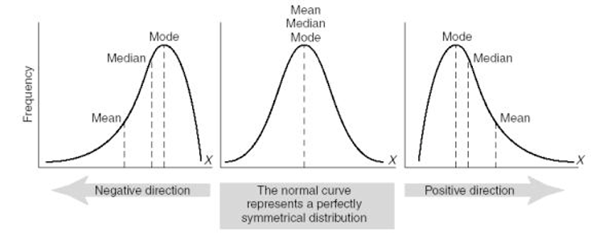

---
output:
  pdf_document: default
  html_document: default
---
# Exploring Categorical and Quantitative Data

## Lecture Notes Week 3: Exploratory Data Analysis 

\setstretch{1}

### Summarizing categorical data {-}

* A ______________ is calculated on data from a sample

* The parameter of interest is what we want to know from the population.

* Includes:

    * Population word (true, long-run, population)
    
    * Summary measure (depends on the type of data)
    
    * Context
    
        * Observational units
        
        * Variable(s)

Categorical data can be numerically summarized by calculating a _______________ from the data set.

Notation used for the population proportion:
    
* Single categorical variable:
       
\vspace{0.2in}
        
* Two categorical variables:
    
\vspace{0.2in}

\rgi \rgi - Subscripts represent the ___________ variable groups
    
Notation used for the sample proportion:
    
* Single categorical variable:

\vspace{0.2in}

* Two categorical variables
    
\vspace{0.2in}

\setstretch{1.5}
Categorical data can be reported in a ____________table, 
which plots counts or a ______________ 
frequency table, which plots the proportion.

When we have two categorical variables we report the data in a  _______________ or two-way table with the _______________ variable on the columns and the ____________ variable on the rows.

\setstretch{1}

\vspace{2mm}

Example for class discussion:  Gallatin Valley is the fastest growing county in Montana.  You’ll often hear Bozeman residents complaining about the ‘out-of-staters’ moving in.  A local real estate agent recorded data on a random sample of 100 home sales over the last year at her company and noted where the buyers were moving from as well as the age of the person or average age of a couple buying a home.  The variable age was binned into two categories, "Under30" and "Over30." Additionally, the variable, state the buyers were moving from, was created as a binary variable, "Out" for a location out of state and "In" for a location in state.  

The following code reads in the data set, `moving_to_mt` and names the object moving.

```{r, echo=TRUE}
moving <- read.csv("data/moving_to_mt.csv")
```

The `R` function `glimpse` was used to give the following output.

```{r, echo=TRUE}
glimpse(moving)
```

* What are the observational units in this study?

\vspace{0.3in}

* What type of variable is `Age`?

\vspace{0.3in}

* What type of variable is `Age_Group`?

To further analyze the categorical variable, `From`, we can create either a frequency table:

```{r, echo=TRUE}
moving %>%
    count(From)
```

Or a relative frequency table:

```{r, echo=TRUE}
moving %>%
  count(From) %>%
  mutate(freq = n/sum(n))
```

* How many home sales have buyers from WA?  

\vspace{0.3in}

* What proportion of sampled home sales have buyers from WA?

\vspace{0.3in}

* What notation is used for the proportion of home sale buyers that that are from WA?

\vspace{0.3in}

\newpage

To look at the relationship between the variable, `Age_Group` and the variable, `From` create the following two-way table using the `R` output below.  Note, we are using `From` as the explanatory variable to predict whether a home sale has a buyer that is over or under the age of 30.

```{r, echo=TRUE, collapse=FALSE}
moving %>%
    group_by(Age_Group) %>% count(From) %>% print(n=8)
```

\begin{center}
\begingroup
\setlength{\tabcolsep}{14pt} % Default value: 6pt
\renewcommand{\arraystretch}{2} % Default value: 1
\begin{tabular}{|c|c|c|c|c|c|}
\hline
 & \multicolumn{4}{|c|}{\textbf{State}} & \\ \hline
\textbf{Age Group} & CA & CO & MT & WA & Total \\ \hline
 Over30 & 6 & 2 & 47 & 10 & 65 \\ \hline
 Under30 & 6 & 6 & 14 & 9 & 35 \\ \hline
 Total & 12 & 8 & 61 & 19 & 100\\ \hline  
\end{tabular}
\endgroup
\end{center}

* Using the table above, how many of the sampled home sales have buyers who were under 30 years old and from Montana?

\vspace{0.2in}

\setstretch{1.5}

If we want to know what proportion of each age group is from each state, we would calculate the proportion of home sales with buyers from each ________________ within each ___________________. In other words, divide the number of home sales from each state with buyers that are over 30 by the total for row 1, the total number of home sales with buyers over 30.

\setstretch{1}

* What proportion of sampled home sales with buyers under 30-years-old were from California?

\vspace{0.3in}

* What notation should be used for this value?

\vspace{0.2in}

\setstretch{1.5}

Additionally, we could find the proportion of home sales with buyers in each state for each age group.  Here we would calculate the proportion of home sales with buyers in each ________________________ within each _____________________.  Divide the number of home sales with buyers in each age group from CA by the total for column 1, the total number of home sales with buyers from CA. 

\setstretch{1}

\begin{center}
\begingroup
\setlength{\tabcolsep}{14pt} % Default value: 6pt
\renewcommand{\arraystretch}{2} % Default value: 1
\begin{tabular}{|c|c|c|c|c|c|}
\hline
 & \multicolumn{4}{|c|}{\textbf{State}} & \\ \hline
\textbf{Age Group} & CA & CO & MT & WA & Total \\ \hline
 Over30 & 6 & 2 & 47 & 10 & 65 \\ \hline
 Under30 & 6 & 6 & 14 & 9 & 35 \\ \hline
 Total & 12 & 8 & 61 & 19 & 100\\ \hline  
\end{tabular}
\endgroup
\end{center}

* Using the table, calculate the proportion of home sales in Gallatin County with in-state buyers who are over 30 years old?  Use appropriate notation with informative subscripts.

\vspace{0.4in}

* Using the table, calculate the proportion of home sales in Gallatin County with California buyers who are over 30 years old?  Use appropriate notation with informative subscripts.

\vspace{0.4in}

* Calculate the difference in proportion of home sales in Gallatin County over 30 years old from other parts of Montana and from California. Use MT - CA as the order of subtraction.  Give appropriate notation.

\vspace{0.4in}

* Interpret the difference in proportion in context of the study.

\vspace{0.5in}

#### Displaying categorical variables {-}

* Types of plots for a single categorical variable

\vspace{0.4in}

* Types of plots for two categorical variables

\vspace{0.4in}

The following code in `R` will create a frequency bar plot of the variable, `From`.

```{r, echo=TRUE, out.width="65%"}
moving %>%
    ggplot(aes(x = From))+ #Enter the variable to plot
    geom_bar(stat = "count") + 
    labs(title = "Frequency Bar Plot of State of Origin for
         Gallatin County Home Sales", 
         #Title your plot (type of plot, observational units, variable)
       y = "Frequency", #y-axis label
       x = "State of Origin") #x-axis label
```

* What can we see from this plot?

\vspace{0.3in}

Additionally, we can create a relative frequency bar plot.

```{r, echo=TRUE, out.width="65%"}
moving %>%
  ggplot(aes(x = From))+ #Enter the variable to plot
  geom_bar(aes(y = after_stat(prop), group = 1)) +
  labs(title = "Relative Frequency Bar Plot of State of Origin 
       for Gallatin County Home Sales", 
       #Title your plot
       y = "Relative Frequency", #y-axis label
       x = "State of Origin") #x-axis label
```

\setstretch{1.5}

* Note: the x-axis is the _______________ between the frequency bar plot and the relative frequency bar plot.  However, the ______________ differs.  The scale for the frequency bar plot goes from _______________________________ and the scale for the relative frequency bar plot is from ______________________________.

\setstretch{1}

\newpage

In a segmented bar plot, the bar for each category will sum to 1.  In this first plot, we are plotting the row proportions calculated conditional on the age group.

```{r, echo=TRUE, out.width="55%"}
moving %>%
  ggplot(aes(x = Age_Group, fill = From))+ #Enter the variables to plot
  geom_bar(stat = "count", position = "fill") +
  labs(title = "Segmented bar plot of Age Group of Buyers by State of 
       Origin for Gallatin County Home Sales", 
       #Title your plot
       y = "Relative Frequency", #y-axis label
       x = "Age Group") + #x-axis label
  scale_fill_grey()
```

In this second plot, we are plotting the column proportions calculated conditional on the state of origin for the buyer.

```{r, echo=TRUE, out.width="55%"}
moving %>%
  ggplot(aes(x = From , fill = Age_Group))+ #Enter variables to plot
  geom_bar(stat = "count", position = "fill") +
  labs(title = "Segmented bar plot of State of Origin of Buyers by Age 
       Group for Gallatin County Home Sales", 
       #Title your plot
       y = "Relative Frequency", #y-axis label
       x = "State of Origin") + #x-axis label
  scale_fill_grey()
```

Mosaic plot: 
```{r, echo=TRUE, warning=FALSE, out.width="75%"}
moving$Age_Group <- factor(moving$Age_Group, levels = c("Under30", "Over30"))
moving %>% # Data set piped into...
  ggplot() +   # This specifies the variables
  geom_mosaic(aes(x=product(From), fill = Age_Group)) +  
    # Tell it to make a mosaic plot
  labs(title = "Mosaic plot of State of Origin Segmented by 
  Age Group for Gallatin County Home Sales",  
       # Title your plot 
       x = "State of Origin",   # Label the x axis
       y = "") +  # Remove y axis label
    scale_fill_grey(guide = guide_legend(reverse = TRUE)) # Make figure color
```

* Why is the bar for MT the widest on the mosaic plot?

\vspace{0.2in}

\newpage

#### Simpson's paradox {-}

\setstretch{1.5}

* When an apparent _____________ between explanatory and response variables reverses when accounting for ______________ variable.

\setstretch{1}

Example: The "Berkeley Dataset" contains all 12,763 applicants to UC-Berkeley's graduate programs in Fall 1973. This dataset was published by UC Berkeley researchers in an analysis to understand the possible gender bias in admissions and has now become a classic example of Simpson's Paradox.  

```{r, echo=TRUE, out.width="85%"}
discrim <- read.csv ("https://waf.cs.illinois.edu/discovery/berkeley.csv")

discrim %>%
  ggplot(aes(x =Gender, fill = Admission))+
  geom_bar(stat = "count", position = "fill") +
  labs(title = "Segmented bar plot of Sex of Berkley Applicants by 
       Admission Status",
       y = "Relative Frequency",
       x = "Sex") +
  scale_fill_grey()
```

The data showed that 44\% of male applicants were accepted and 35\% of female applicants were accepted.  Does it appear that the female students are discriminated against?

\vspace{0.1in}

We can break down the data by major.  A major code (either A, B, C, D, E, F, or Other) was used.

\newpage

Here we look at the relationship between admission status and sex for Program A and for Program B.

```{r, out.width="85%"}
include_graphics("images/SimPara_AB.png")
```

Showing Program C and Program D.

```{r, out.width="85%"}
include_graphics("images/SimPara_cD.png")
```

And finally, Program E and F.

```{r, out.width="85%"}
include_graphics("images/SimPara_EF.png")
```

We can see in several programs the acceptance rate is higher for females than for males. 

\vspace{1in}

\newpage

### Summarizing quantitative data {-}

\setstretch{1.5}

Quantitative data can be numerically summarized by finding:

Two measures of center: 

* Mean: ____________ of all the _____________ in the data set.

    - Sum the values in the data set and divide
    the sum by the sample size
    
* Notation used for the population mean:
    
    - Single quantitative variable:
       
\vspace{0.2in}
        
\rgi \rgi - One categorical and one quantitative variable:
    
\vspace{0.2in}

\rgi \rgi \rgi - Subscripts represent the ___________ variable groups
    
* Notation used for the sample mean:
    
\rgi \rgi - Single quantitative variable:

\vspace{0.2in}

\rgi \rgi - One categorical and one quantitative variable:
    
\vspace{0.2in}

* Median: Value at the _____________ percentile

    - __________ % of values are at and ___________ and at and ___________ the value of the ______________.

    - Middle value in a list of ordered values

Two measures of spread:

* Standard deviation:  On average ___________________ each data point if from the ______________ of the data set.

\vspace{1mm}

\rgi \rgi - Notation used for the population standard deviation

\vspace{0.2in}

\rgi \rgi - Notation used for the sample standard deviation

\vspace{0.2in}

\newpage

* Interquartile range: middle 50% of data values

\rgi Formula:

\rgi \rgi Quartile 3 (Q3) - value at the 75th percentile

\rgi \rgi - ____________ % of values are at and _____________ the value of Q3

\rgi \rgi Quartile 1 (Q1) - value at the 25th percentile

\rgi \rgi - _____________ % of values are at and _____________ the value of Q1

\vspace{1mm}

\setstretch{1}

#### Types of plots{-}

We will revisit the moving to Montana data set and plot the age of the buyers.

* Dotplot:

\vspace{0.5in}

```{r, echo=TRUE, out.width="75%"}
moving %>%
  ggplot(aes(x = Age))+ #Enter variable to plot
  geom_dotplot() + 
  labs(title = "Dotplot of Age of Buyers from Gallatin 
       County Home Sales", #Title your plot
       x = "Age", #x-axis label
       y = "Proportion") #y-axis label
```

\newpage

* Histogram

\vspace{0.2in}

```{r, echo=TRUE, out.width="70%"}
moving %>%
  ggplot(aes(x = Age))+
  geom_histogram(binwidth = 7) + 
  labs(title = "Histogram of Age of Buyers from Gallatin 
       County Home Sales",
       #Title your plot
       x = "Age",
       y = "Count")
```

\newpage

* Boxplot

    - Five number summary: minimum, Q1, median, Q3, maximum

\vspace{0.3in}

```{r, echo=TRUE, out.width="70%"}
moving %>%
  ggplot(aes(x = Age))+ #Enter variable to plot
  geom_boxplot() + 
  labs(title = "Boxplot of Age of Buyers from Gallatin 
       County Home Sales", #Title your plot
       x = "Age", #x-axis label
       y = "") #y-axis label

```

```{r, echo=TRUE}
favstats(moving$Age)
```


Interpret the value of $Q_3$ for the age of buyers.

\vspace{0.5in}

Interpret the value of s for the age of buyers.

\vspace{0.5in}

\newpage

#### Four characteristics of plots for quantitative variables {-}

* Shape: overall pattern of the data

```{r, out.width="80%"}

```

\rgi \rgi - What is the shape of the distribution of age of buyers for Gallatin County home sales?

\vspace{0.3in}

* Center:  

\rgi Mean or Median

\rgi \rgi - Report the measure of center for the boxplot of age of buyers for Gallatin County home sales.

\vspace{0.3in}

* Spread (or variability):

\rgi Standard deviation or IQR

\rgi \rgi - Report the IQR for the distribution of age of buyers from Gallatin County home sales.

\vspace{0.3in}

* Outliers?

\rgi values < $Q_1 - 1.5 \times IQR$

\rgi values > $Q_3 + 1.5 \times IQR$

\rgi \rgi - Use these formulas to show that there are no outliers in the distribution of age of buyers from Gallatin County home sales.

\vspace{0.8in}
\newpage

Let's look at side-by-side boxplot of the variable age by state of origin moved from.

```{r, echo=TRUE, out.width="85%"}
moving %>%  # Data set piped into...
  ggplot(aes(y = Age, x = From))+  # Identify variables
  geom_boxplot()+  # Tell it to make a box plot
  labs(title = "Side by side box plot of Age by State of Origin 
  of Buyers from Gallatin County Home Sales",  # Title
       x = "State of Origin",    # x-axis label
       y = "Age")  # y-axis label
```

* Which state of origin had the oldest median age of buyers from sampled home sales?

\vspace{0.3in}

* Which state of origin had the most variability in age of buyers from sampled home sales?

\vspace{0.3in}

* Which state of origin had the most symmetric distribution of ages of buyers from sampled home sales?

\vspace{0.3in}

* Which state of origin had outliers for the age of buyers from sampled home sales?

\vspace{0.3in}

\newpage

#### Robust statistics {-}

Let's review the summary statistics and histogram of age of buyers from sampled home sales.

```{r, echo=FALSE, out.width="85%"}
moving %>%
  ggplot(aes(x = Age))+
  geom_histogram(binwidth = 7) + 
  labs(title = "Histogram of Age of Buyers from Gallatin 
       County Home Sales", 
       x = "Age",
       y = "Count")
```

```{r, echo=FALSE}
favstats(moving$Age)
```

\setstretch{1.5}

Notice that the _____________ has been pulled in the direction of the _______________.  

* The ___________ is a ______________ measure of center.

* The ___________ is a ______________ measure of spread.

* Robust means not _________________ by.

When the distribution is symmetric use the ____________ as the measure of center and the ___________ as the measure of spread.

When the distribution is skewed with outliers use the _____________ as the measure of center and the ____________ as the measure of spread.

\setstretch{1}

\newpage
