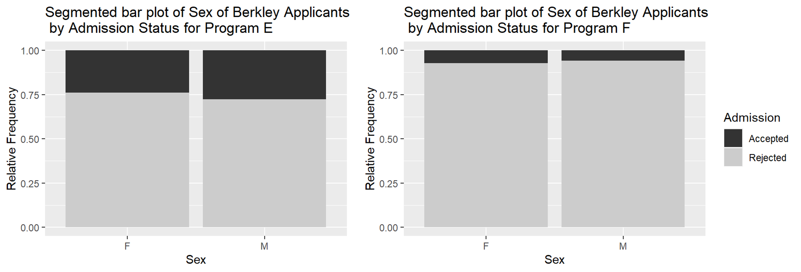

## Lecture Notes Week 3: Exploratory Data Analysis 

\setstretch{1}

### Summarizing categorical data {-}

* A ______________ is calculated on data from a sample

* The parameter of interest is what we want to know from the population.

* Includes:

    * Population word (true, long-run, population)
    
    * Summary measure (depends on the type of data)
    
    * Context
    
        * Observational units
        
        * Variable(s)

Categorical data can be numerically summarized by calculating a _______________ from the data set.

Notation used for the population proportion:
    
* Single categorical variable:
       
\vspace{0.2in}
        
* Two categorical variables:
    
\vspace{0.2in}

\rgi \rgi - Subscripts represent the ___________ variable groups
    
Notation used for the sample proportion:
    
* Single categorical variable:

\vspace{0.2in}

* Two categorical variables
    
\vspace{0.2in}

\setstretch{1.5}
Categorical data can be reported in a ____________table, 
which plots counts or a ______________ 
frequency table, which plots the proportion.

When we have two categorical variables we report the data in a  _______________ or two-way table with the _______________ variable on the columns and the ____________ variable on the rows.

\setstretch{1}

Example:  Gallatin Valley is the fastest growing county in Montana.  You’ll often hear Bozeman residents complaining about the ‘out-of-staters’ moving in.  A local real estate agent recorded data on a random sample of 100 home sales over the last year at her company and noted where the buyers were moving from as well as the age of the person or average age of a couple buying a home.  The variable age was binned into two categories, "Under30" and "Over30." Additionally, the variable, state the buyers were moving from, was created as a binary variable, "Out" for a location out of state and "In" for a location in state.  

The following code reads in the data set, `moving_to_mt` and names the object moving.

```{r, echo=TRUE}
moving <- read.csv("data/moving_to_mt.csv")
```


The `R` function `glimpse` was used to give the following output.

```{r, echo=TRUE}
glimpse(moving)
```

* What are the observational units in this study?

\vspace{0.3in}

* What type of variable is `Age`?

\vspace{0.3in}

* What type of variable is `Age_Group`?

To further analyze the categorical variable, `From`, we can create either a frequency table:

```{r, echo=TRUE}
moving %>%
    count(From)
```

Or a relative frequency table:

```{r, echo=TRUE}
moving %>%
  count(From) %>%
  mutate(freq = n/sum(n))
```

* How many buyers are from WA?  

\vspace{0.3in}

* What proportion of sampled buyers are from WA?

\vspace{0.3in}

* What notation is used for the proportion of buyers that that are from WA?

\vspace{0.3in}

To look at the relationship between the variable, `Age_Group` and the variable, `From` create the following two-way table using the `R` output below.  Note, we are using `From` as the explanatory variable to predict whether a buyer is over or under the age of 30.

```{r, echo=TRUE, collapse=FALSE}
moving %>%
    group_by(Age_Group) %>% count(From) %>% print(n=8)
```

\begin{center}
\begingroup
\setlength{\tabcolsep}{14pt} % Default value: 6pt
\renewcommand{\arraystretch}{2} % Default value: 1
\begin{tabular}{|c|c|c|c|c|c|}
\hline
 & \multicolumn{4}{|c|}{\textbf{State}} & \\ \hline
\textbf{Age Group} & CA & CO & MT & WA & Total \\ \hline
 Over30 & & & & & \\ \hline
 Under30 & & & & & \\ \hline
 Total & & & & & \\ \hline  
\end{tabular}
\endgroup
\end{center}

* Using the table above, how many of sampled buyers were under 30 years old and from Montana?

\vspace{0.2in}

\setstretch{1.5}

If we want to know what proportion of each age group is from each state, we would calculate the proportion of buyers from each ________________ from each ___________________. In other words, divide the number of buyers from each state that are over 30 by the total for row 1, the total number of buyers over 30.

\setstretch{1}

* What proportion of under 30-year-old sampled buyers were from California?

\vspace{0.3in}

* What notation should be used for this value?

\vspace{0.2in}

\setstretch{1.5}

Additionally, we could find the proportion of buyers in each state for each age group.  Here we would calculate the proportion of buyers in each ________________________ for each _____________________.  Divide the number of buyers in each age group from CA by the total for column 1, the total number of buyers from CA. 

\setstretch{1}

Fill in the following table, to find the column proportions.

\begin{center}
\begingroup
\setlength{\tabcolsep}{14pt} % Default value: 6pt
\renewcommand{\arraystretch}{2} % Default value: 1
\begin{tabular}{|c|c|c|c|c|}
\hline
 & \multicolumn{3}{|c|}{\textbf{State}} & \\ \hline
\textbf{Age Group} & CA & CO & MT & WA  \\ \hline
 Over30 & & & &  \\ \hline
 Under30 & & & & \\ \hline
\end{tabular}
\endgroup
\end{center}

* What does the value 0.770 represent?

\vspace{0.3in}

#### Displaying categorical variables {-}

* Types of plots for a single categorical variable

\vspace{0.4in}

* Types of plots for two categorical variables

\vspace{0.4in}

The following code in `R` will create a frequency bar plot of the variable, `From`.

```{r, echo=TRUE, out.width="85%"}
moving %>%
    ggplot(aes(x = From))+ #Enter the variable to plot
    geom_bar(stat = "count") + 
    labs(title = "Frequency Bar Plot of State of Origin", #Title your plot
       y = "Frequency", #y-axis label
       x = "State of Origin") #x-axis label
```

* What can we see from this plot?

\vspace{0.3in}

Additionally, we can create a relative frequency bar plot.

```{r, echo=TRUE, out.width="85%"}
moving %>%
  ggplot(aes(x = From))+ #Enter the variable to plot
  geom_bar(aes(y = after_stat(prop), group = 1)) +
  labs(title = "Relative Frequency Bar Plot of State of Origin", #Title your plot
       y = "Relative Frequency", #y-axis label
       x = "State of Origin") #x-axis label
```

\setstretch{1.5}

* Note: the x-axis is the _______________ between the frequency bar plot and the relative frequency bar plot.  However, the ______________ differs.  The scale for the frequency bar plot goes from _______________________________ and the scale for the relative frequency bar plot is from ______________________________.

\setstretch{1}

In a segmented bar plot, the bar for each category will sum to 1.  In this first plot, we are plotting the row proportions calculated conditional on the age group.

```{r, echo=TRUE, out.width="80%"}
moving %>%
  ggplot(aes(x = Age_Group, fill = From))+ #Enter the variables to plot
  geom_bar(stat = "count", position = "fill") +
  labs(title = "Segmented bar plot of Age Group of Buyers \n by State of Origin", #Title your plot
       y = "Relative Frequency", #y-axis label
       x = "Age Group") + #x-axis label
  scale_fill_grey()
```

In this second plot, we are plotting the column proportions calculated conditional on the state of origin for the buyer.

```{r, echo=TRUE, out.width="80%"}
moving %>%
  ggplot(aes(x = From , fill = Age_Group))+ #Enter variables to plot
  geom_bar(stat = "count", position = "fill") +
  labs(title = "Segmented bar plot of State of Origin of Buyers \n by Age Group", #Title your plot
       y = "Relative Frequency", #y-axis label
       x = "State of Origin") + #x-axis label
  scale_fill_grey()
```

Mosaic plot: 
```{r, echo=TRUE, warning=FALSE, out.width="80%"}
moving$Age_Group <- factor(moving$Age_Group, levels = c("Under30", "Over30"))
moving %>% # Data set piped into...
  ggplot() +   # This specifies the variables
  geom_mosaic(aes(x=product(From), fill = Age_Group)) +  # Tell it to make a mosaic plot
  labs(title = "Mosaic plot of State of Origin \n Segmented by Age Group",  # Make sure to title your plot 
       x = "State of Origin",   # Label the x axis
       y = "") +  # Remove y axis label
    scale_fill_grey(guide = guide_legend(reverse = TRUE)) # Make figure color
```

* Why is the bar for MT the widest on the mosaic plot?

\vspace{0.2in}

\newpage

#### Simpson's paradox {-}

* When an apparent _____________ between explanatory and response variables reverses when accounting for ______________ variable.

Example: The "Berkeley Dataset" contains all 12,763 applicants to UC-Berkeley's graduate programs in Fall 1973. This dataset was published by UC-Berkeley researchers in an analysis to understand the possible gender bias in admissions and has now become a classic example of Simpson's Paradox.  

```{r, echo=TRUE, out.width="85%"}
discrim <- read.csv ("https://waf.cs.illinois.edu/discovery/berkeley.csv")

discrim %>%
  ggplot(aes(x =Gender, fill = Admission))+
  geom_bar(stat = "count", position = "fill") +
  labs(title = "Segmented bar plot of Sex of Berkley Applicants \n by Admission Status",
       y = "Relative Frequency",
       x = "Sex") +
  scale_fill_grey()
```

The data showed that 44\% of male applicants were accepted and 35\% of female applicants were accepted.  Does it appear that the female students are discriminated against?

\vspace{0.1in}

We can break down the data by major.  A major code (either A, B, C, D, E, F, or Other) was used.

\newpage

Here we look at the relationship between admission status and sex for Program A and for Program B.

```{r, out.width="85%"}
include_graphics("images/SimPara_AB.png")
```

Showing Program C and Program D.

```{r, out.width="85%"}
include_graphics("images/SimPara_cD.png")
```

And finally, Program E and F.

```{r, out.width="85%"}

```

We can see in several programs the acceptance rate is higher for females than for males. 

\vspace{1in}

### Summarizing quantitative data {-}

Quantitative data can be numerically summarized by finding:

Two measures of center: 

* Mean: 

\vspace{0.8in}

* Median:

\vspace{0.8in}

Two measures of spread:

* Standard deviation:

\vspace{0.8in}

* Interquartile range:

\vspace{0.8in}

#### Types of plots{-}

We will revisit the moving to Montana data set and plot the age of the buyers.

* Dotplot:

\vspace{0.5in}

```{r, echo=TRUE, out.width="80%"}
moving %>%
  ggplot(aes(x = Age))+ #Enter variable to plot
  geom_dotplot() + 
  labs(title = "Dotplot of Age of Buyers", #Title your plot
       x = "Age", #x-axis label
       y = "Proportion") #y-axis label
```

* Histogram

\vspace{0.2in}

```{r, echo=TRUE, out.width="80%"}
moving %>%
  ggplot(aes(x = Age))+
  geom_histogram(binwidth = 7) + 
  labs(title = "Histogram of Age of Buyers", 
       x = "Age",
       y = "Count")
```

\newpage

* Boxplot

\vspace{0.5in}

```{r, echo=TRUE, out.width="80%"}
moving %>%
  ggplot(aes(x = Age))+ #Enter variable to plot
  geom_boxplot() + 
  labs(title = "Boxplot of Age of Buyers", #Title your plot
       x = "Age", #x-axis label
       y = "") #y-axis label

```

```{r, echo=TRUE}
favstats(moving$Age)
```

#### Four characteristics of plots for quantitative variables {-}

* Shape:

\vspace{0.7in}

* Center:

\vspace{0.5in}

* Spread (or variability):

\vspace{0.5in}

* Outliers?

\vspace{0.7in}

Let's look at side-by-side boxplot of the variable age by state of origin moved from.

```{r, echo=TRUE, out.width="85%"}
moving %>%  # Data set piped into...
  ggplot(aes(y = Age, x = From))+  # Identify variables
  geom_boxplot()+  # Tell it to make a box plot
  labs(title = "Side by side box plot of age by state of origin",  # Title
       x = "State of Origin",    # x-axis label
       y = "Age")  # y-axis label
```

* Which state of origin had the oldest median age of sampled buyers?

\vspace{0.3in}

* Which state of origin had the most variability in age of sampled buyers?

\vspace{0.3in}

* Which state of origin had the most symmetric distribution of ages of sampled buyers?

\vspace{0.3in}

* Which state of origin had outliers?

\vspace{0.3in}

#### Robust statistics {-}

Let's review the summary statistics and histogram of age of buyers.

```{r, echo=FALSE, out.width="85%"}
moving %>%
  ggplot(aes(x = Age))+
  geom_histogram(binwidth = 7) + 
  labs(title = "Histogram of Age of Buyers", 
       x = "Age",
       y = "Count")
```

```{r, echo=FALSE}
favstats(moving$Age)
```

\setstretch{1.5}

Notice that the _____________ has been pulled in the direction of the _______________.  

* The ___________ is a ______________ measure of center.

* The ___________ is a ______________ measure of spread.

* Robust means not affected by.

When the distribution is symmetric use the ____________ as the measure of center and the ___________ as the measure of spread.

When the distribution is skewed with outliers use the _____________ as the measure of center and the ____________ as the measure of spread.

\setstretch{1}

\newpage
