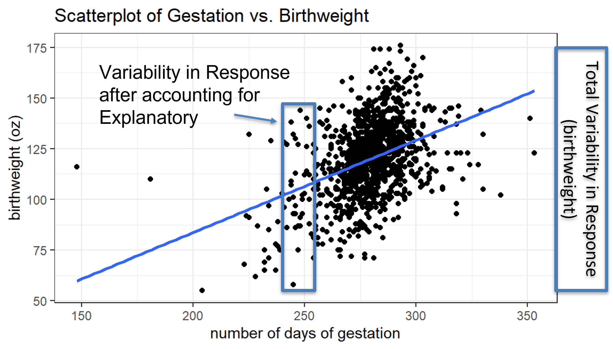

## Lecture Notes Week 4: Regression and Correlation

\setstretch{1}

### Summary measures and plots for two quantitative variables {-}

Four characteristics of the scatterplot:
	
* Form: 

\vspace{0.2in}

* Direction: 

\vspace{0.2in}

* Strength: 

\vspace{0.2in}

* Outliers: 

\vspace{0.2in}

\rgi \rgi - Influential points: outliers that change the regression line; far from the line of regression

\rgi \rgi - High leverage points: outliers that are extreme in the x\- axis; far from the mean of the x-axis

\setstretch{1.5}

The summary measures for two quantitative variables are:

* ____________________________

* ____________________________

* ____________________________

\setstretch{1}

* Least-squares regression line: $\hat{y}=b_0+b_1\times x$ (put y and x in the context of the problem) or $\widehat{response}=b_0+b_1 \times \text{explanatory}$

* $\hat{y}$ or $\widehat{\text{response}}$ is

\vspace{0.2in}

* $b_0$ is
    
\vspace{0.2in}

* $b_1$ is 
    
\vspace{0.2in}

* $x$ or explanatory is 
    
\vspace{0.2in}

\setstretch{1.5}
    * The estimates for the linear model output will give the value of the ___________________ and the ______________.
    
* Interpretation of slope: an increase in the _____________ variable of 1 unit is associated with an increase/decrease in the ________________ variable by the value of slope, on average.

* Interpretation of the y-intercept: for a value of 0 for the _____________ variable, the predicted value for the __________ variable would be the value of y-intercept.

* We can predict values of the ___________ variable by plugging in a give __________ variable value using the least squares equation line.

* A prediction of a response variable value for an explanatory  value outside the range of x values is called _______________.

* To find how far the predicted value deviates from the actual value we find the ____________.

    * residual = observed y - predicted y
    
* To find the least squares regression line the line with the __________ SSE is found.

    * SSE = 
    
    * To find SSE, the _________ for each data point is found, squared and all the squared residuals are summed together
    
Correlation is always between the values of _______ and ________.  

* Measures the _____________ and ______________ of the linear relationship between two quantitative variables.

* The stronger the relationship between the variables the closer the value of _______________ is to ________ or ________.

* The sign give the _________________.

The coefficient of determination can be found using the _____________ for each variable or the SSE and SST (sum of squared total)

* $r^2 = (r)^2 = \frac{SST - SSE}{SST} = \frac{s^2_y - s^2_{residual}}{s^2_y}$

* The coefficient of determination measures the ____________ of variation in the ___________ variable that is explained by the changes in the _____________ variable.

Notation:

* Population slope: 

* Population correlation:

* Sample slope:

* Sample correlation:

\setstretch{1}

Example: Data was collected from 1236 births between 1960 and 1967 in the San Francisco East Bay area to better understand what variables contributed to child birth weight, as children with low birth weight often suffer from an array of complications later in life.  

```{r, echo=TRUE}
babies<-read.csv("data/babies.csv")
glimpse(babies)
```


Here you see a glimpse of the data.  The 1236 rows correspond to the sample size.  The case variable is labeling each pregnancy 1 through 1236.  Then 7 variables are recorded.  Birthweight (bwt), length of gestation in days, parity is called an indicator variable telling us if the pregnancy was a first pregnancy (labeled as 0) or not (labeled as 1) were recorded about the child and pregnancy.  The age, height, and weight were recorded for the mother giving birth, as was smoke, another indicator variable where 0 means the mother did not smoke during pregnancy, and 1 indicates that she did smoke while pregnant.  

The following shows a scatterplot of length of gestation as a predictor of birthweight.

```{r, echo=TRUE, warning=FALSE}
babies %>% # Data set pipes into...
ggplot(aes(x = gestation, y = bwt))+  # Specify variables
  geom_point() +  # Add scatterplot of points
  labs(x = "number of days of gestation",  # Label x-axis
       y = "birthweight (oz)",  # Label y-axis
       title = "Scatterplot of Gestation vs. Birthweight") + # Be sure to title your plots
  geom_smooth(method = "lm", se = FALSE)  # Add regression line
```

Describe the scatterplot using the four characteristics.

\vspace{1in}

The linear model output for this study is given below:

```{r, echo=TRUE}
# Fit linear model: y ~ x
babiesLM <- lm(bwt ~ gestation, data=babies)
summary(babiesLM)$coefficients # Display coefficient summary
```
Write the least squares equation of the line.

\vspace{0.6in}

Interpret the slope in context of the problem.

\vspace{0.6in}

Interpret the y-intercep

\vspace{0.6in}

Predict the birthweight of a baby with 310 days gestation.

\vspace{0.5in}

Calculate the residual for a baby with a birthweight of 151 ounces and at 310 days gestation.

\vspace{0.5in}

Is this value (151, 310) above or below the line of regression?  Did the line of regression overestimate or underestimate the birthweight.

\vspace{0.5in}

The following code finds the value of correlation between gestation and birthweight.

```{r, echo=TRUE}
cor(bwt~gestation, data=babies, use="pairwise.complete.obs")
```
This shows a ___________, _____________ relationship between gestation and birthweight.

Calculate and interpret the coefficient of determination between gestation and birthweight.

\vspace{0.8in}

```{r, out.width="90%"}

```

#### Multivariable plots {-}

Aesthetics: visual property of the objects in your plot

* Position on the axes: groups for ____________ variables, or a number line if the variable is _______________

* Color or shape - to represent _________ variables

* Size - to represent __________ variables

Adding the quantitative variable maternal age to the scatterplot between gestation and birthweight.

```{r, echo=TRUE, warning=FALSE}
babies %>% # Data set pipes into...
ggplot(aes(x = gestation, y = bwt, size=age))+  # Specify variables
  geom_point(shape=1) +  # Add scatterplot of points
  labs(x = "number of days of gestation",  # Label x-axis
       y = "birthweight (oz)",  # Label y-axis
       title = "Scatterplot of Gestation vs. Birthweight by Age") + # Be sure to title your plots
  geom_smooth(method = "lm", se = FALSE)  # Add regression line
```


Is there an association between maternal age and birthweight?

```{r, echo=TRUE, warning=FALSE}
babies %>% # Data set pipes into...
ggplot(aes(x = age, y = bwt))+  # Specify variables
  geom_point() +  # Add scatterplot of points
  labs(x = "number of days of gestation",  # Label x-axis
       y = "birthweight (oz)",  # Label y-axis
       title = "Scatterplot of Birthweight by Age") + # Be sure to title your plots
  geom_smooth(method = "lm", se = FALSE)  # Add regression line
```

```{r, echo=TRUE}
cor(bwt~age, data=babies, use="pairwise.complete.obs")
```

Is there an association between maternal age and gestation?

```{r, echo=TRUE, warning=FALSE}
babies %>% # Data set pipes into...
ggplot(aes(x = gestation, y = age))+  # Specify variables
  geom_point() +  # Add scatterplot of points
  labs(x = "number of days of gestation",  # Label x-axis
       y = "age",  # Label y-axis
       title = "Scatterplot of Gestation vs. Aage") + # Be sure to title your plots
  geom_smooth(method = "lm", se = FALSE)  # Add regression line
```

```{r, echo=TRUE}
cor(age~gestation, data=babies, use="pairwise.complete.obs")
```
Let's add the categorical variable, whether a mother smoked, to the scatterplot between gestataion and birthweight.

```{r, echo=TRUE, warning=FALSE}
babies <- babies %>% 
    mutate(smoke = factor(smoke)) %>%
    na.omit()
           
babies %>% # Data set pipes into...
ggplot(aes(x = gestation, y = bwt, color=smoke))+  # Specify variables
  geom_point() +  # Add scatterplot of points
  labs(x = "number of days of gestation",  # Label x-axis
       y = "birthweight (oz)",  # Label y-axis
       title = "Scatterplot of Gestation vs. Birthweight by Smoking Status") + # Be sure to title your plots
  geom_smooth(method = "lm", se = FALSE) + # Add regression line
    scale_fill_grey()
```

Does the relationship between length of gestation and birthweight appear to depend upon maternal smoking status? 

\vspace{1in}

Is the variable smoking status a potential confounding variable?

\vspace{1in}

Adding a categorical predictor:

\setstretch{1.5}

* Look at the regression line for each level of the ____________

* If the slopes are ______________, the two predictor variables do not ___________ to help explain the response

* If the slopes _________________, there is an interaction between the categorical predictor and the relationship between the two quantitative variables.

\setstretch{1}

\newpage
