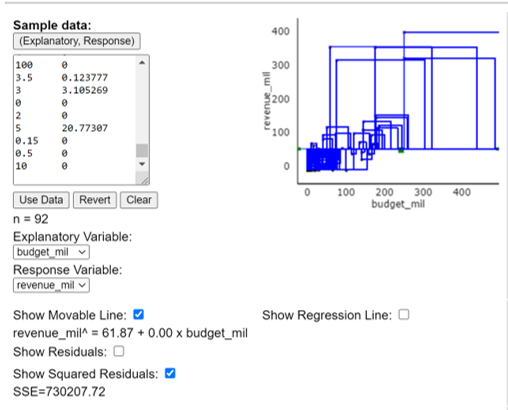
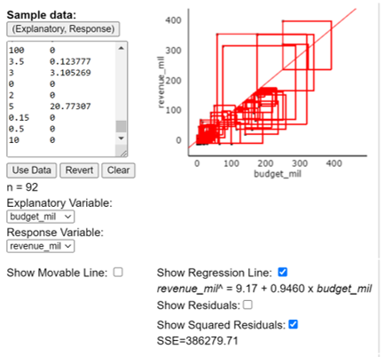

## Out-of-Class Activity Week 4:  Movie Profits --- Correlation and Coefficient of Determination

\setstretch{1}

### Learning outcomes

* Identify and create appropriate summary statistics and plots
  given a data set with two quantitative variables.
  
* Calculate and interpret $r^2$, the coefficient of determination, in context of the problem.

* Find the correlation coefficient from `R` output or from $r^2$ and the sign of the slope.

### Terminology review

In today's activity, we will review summary measures and plots for two quantitative variables.  Some terms covered in this activity are:

* Correlation ($r$)

* Coefficient of determination ($r$-squared)

To review these concepts, see Chapter 6 in the textbook.  

### Movies released in 2016

A data set was collected on movies released in 2016 [@imdb].  Here is a list of some of the variables collected on the observational units, movies released in 2016.  (Note: both budget and revenue are measured in "millions of dollars" (\$MM).) 

| **Variable** 	| **Description** |
|----	|-------------	|
| `budget_mil` | Amount of money (\$MM) budgeted for the production of the movie |
| `revenue_mil` | Amount of money (\$MM) the movie made after release|
| `duration` | Length of the movie (in minutes)|
| `content_rating` | Rating of the movie (`G`, `PG`, `PG-13`, `R`, `Not Rated`)|
| `imdb_score` | IMDb user rating score from 1 to 10 |
| `genres` | Categories the movie falls into (e.g., Action, Drama, etc.) |
| `facebook_likes` | Number of likes a movie receives on Facebook |

\newpage

#### Correlation  {-}

Correlation measures the strength and the direction of the linear relationship between two quantitative variables.  The closer the value of correlation to $+1$ or $-1$, the stronger the linear relationship.  Values close to zero indicate a very weak linear relationship between the two variables.  

<!-- The following output shows a correlation matrix between several pairs of quantitative variables.  Upload and open the Movie Profits Out of Class Activity F22 Code `R` script file. Highlight and run lines 1--12. Highlight and run lines 1--12 to produce the same table as below. -->


```{r, echo=TRUE, collapse = FALSE}
movies <- read.csv("https://math.montana.edu/courses/s216/data/Movies2016.csv") # Reads in data set
movies %>%  # Data set pipes into
  select(c("budget_mil", "revenue_mil", 
           "duration", "imdb_score", 
           "facebook_likes")) %>%
  cor(use="pairwise.complete.obs") %>%
  round(3)
```

1.  Explain why the correlation values on the diagonal are equal to 1.
\vspace{0.8in}

2.  Using the output above, ignoring the values of 1, which pair of variables have the *strongest* correlation? What is the value of this correlation?

\vspace{0.5in}

3.  What is the value of correlation between budget and revenue?

\vspace{0.3in}

#### Coefficient of determination (squared correlation) {-}

Another summary measure used to explain the linear relationship between two quantitative variables is the coefficient of determination ($r^2$). The coefficient of determination, $r^2$, can also be used to describe the strength of the linear relationship between two quantitative variables. The value of $r^2$ (a value between 0 and 1) represents the **proportion of variation in the response that is explained by the least squares line with the explanatory variable**.  There are two ways to calculate the coefficient of determination: 

|    Square the correlation coefficient:  $r^2 = (r)^2$

|    Use the variances of the response and the residuals:  $r^2 = \dfrac{s_y^2 - s_{RES}^2}{s_y^2} = \dfrac{SST - SSE}{SST}$


4.  Use the correlation, $r$, found in question 3 of the activity, to calculate the coefficient of determination between budget and revenue, $r^2$.

\vspace{.4in}

5.  The variance of the response variable, revenue in \$MM, is about $s_{revenue}^2 = 8024.261$ \$MM$^2$  and the variability in the residuals is about $s_{RES}^2 = 4244.832$ \$MM$^2$.  Use these values to calculate the coefficient of determination.  Verify that your answers to 4 and 5 are the same.

\vspace{1in}

In the next part of the activity we will explore what the coefficient of determination measures. 

In Figure \@ref(fig:horizontal-line), we see the data plotted with a horizontal line. Note that the line has a slope of zero, this shows no relationship between budget and revenue. 

```{r horizontal-line, fig.align = "center", out.width="50%", fig.cap="Plot of the data with no slope."}

```

6.  Write down the value of SSE given in this image.  Since this is the sum of squared errors (SSE) for the horizontal line we call this the total sum of squares (SST).
\vspace{3mm}

    SST = 

\newpage

In Figure \@ref(fig:regression-line), we see the data plotted with the regression line (we will learn more about the regression line in the next class). This is the line of best fit between budget and revenue. 

```{r regression-line, fig.align = "center", out.width="50%", fig.cap="Plot of the data showing the regression line."}

```

7. Write down the value for SSE from this image.
\vspace{3mm}

    SSE =  

\vspace{0.2in}

<!-- * Go to the website www.rossmanchance.com/ISIapplets.html and click on Corr/Regresssion under Quantitative Response.   -->

<!-- * Click `Clear` below the box containing the sample data.  -->

<!-- * Download and open the csv file "Movie2016" from D2L.  Copy the two columns containing `budget_mil` and `revenue_mil` including the headers and paste into the sample data box.   -->

<!-- * Click 'Use Data`. -->

<!-- 8.  Click on `Show Moveable Line`.  Write down the equation of the line given.  Why is the slope zero for this line? -->

<!-- \vspace{0.8in} -->

<!-- 9.  Click on `Show Squared Residuals`.  Write down the value for SSE.  Since this is the sum of squared errors (SSE) for the horizontal line we call this the total sum of squares (SST). -->

<!-- \newpage -->

<!-- 10. Click on `Show Regression Line`.  Write down the equation of the line given.  Does this match the least squares line found in Activity 4A question 4? -->

<!-- \vspace{1in} -->

<!-- 11. Click on `Show Squared Residuals`.  Write down the value for SSE. -->

<!-- \vspace{0.5in} -->

8.  Calculate the value for $r^2$ using the values found for SST and SSE.  

\vspace{1in}

9.  Write a sentence interpreting the coefficient of determination in context of the problem.

\newpage


### Take-home messages

1. The sign of correlation and the sign of the slope will always be the same.  The closer the value of correlation is to $-1$ or $+1$, the stronger the linear relationship between the explanatory and the response variable.  

2.  The coefficient of determination multiplied by 100 ($r^2 \times 100$) measures the percent of variation in the response variable that is explained by the relationship with the explanatory variable.  The closer the value of the coefficient of determination is to 100\%, the stronger the relationship.

### Additional notes

Use this space to summarize your thoughts and take additional notes on today's activity and material covered.

\newpage