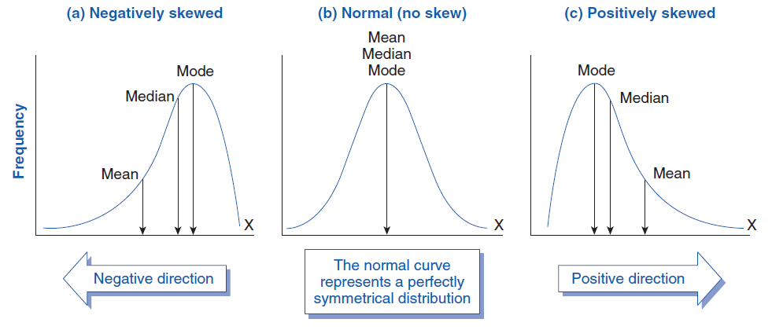

---
output:
  pdf_document: default
  html_document: default
---
## Video Notes: Analysis of One Quantitative Variable

Read Chapters 5 and 17 in the course textbook.  Use the following videos to complete the Module 6 video notes.

### Course Videos

* One_Quantitative_Variable_Statistics

* One_Quantitative_Variable_Plots

* Simulation_Tests_One_Quantitative_Variable

* Bootstrap_Intervals_One_Quantitative_Variable

\setstretch{1}

### Video: One Quantitative Variable - Statistics (sections 5.2, 5.4, 5.5 and 5.7) {-}

\setstretch{1.5}

Quantitative data can be numerically summarized by finding:

Two measures of center: 

* Mean: ____________ of all the _____________ in the data set.

    - Sum the values in the data set and divide the sum by the sample size
    
    - Notation used for the population mean:
    
    - Notation used for the sample mean:
    
\vspace{0.1in}

* Median: Value at the _____________ percentile

    - __________ % of values are at and ___________ and at and ___________ the value of the ______________.

    - Middle value in a list of ordered values

Two measures of spread:

* Standard deviation:  Average ___________________ each data point is from the ______________ of the data set.

\vspace{1mm}

\rgi \rgi - Notation used for the population standard deviation

\vspace{0.2in}

\rgi \rgi - Notation used for the sample standard deviation

\vspace{0.2in}

* Interquartile range: middle 50% of data values

\rgi Formula:

\newpage

\rgi \rgi Quartile 3 (Q3) - value at the 75th percentile

\rgi \rgi - ____________ % of values are at and _____________ the value of Q3

\rgi \rgi Quartile 1 (Q1) - value at the 25th percentile

\rgi \rgi - _____________ % of values are at and _____________ the value of Q1

\vspace{1mm}

* The ___________ is a robust measure of center.

* The ___________ is a robust measure of spread.

* Robust means not _________________ by outliers.

When the distribution is symmetric without outliers, use the ____________ as the measure of center and the ___________ as the measure of spread.

When the distribution is skewed or has outliers, use the _____________ as the measure of center and the ____________ as the measure of spread.

\setstretch{1}


### Video: One Quantitative Variable - Plots (sections 5.2, 5.3 and 5.5) {-}

Three types of plots for displaying one quantitative variable:

\setstretch{1.5}

* Dotplot: each dot represents one __________________________

\rgi \rgi - x-axis represents the scale of the ____________________

\rgi \rgi - y-axis represents the ___________________________


* Histogram: Similar to dotplot, but the observational units are "binned".  

\rgi \rgi - Y-axis represents the number of observational units (frequency) in each "bin"

\rgi \rgi How is a histogram different from a bar plot?

\vspace{0.3in}


* Boxplot: displays the five number summary

    - Five number summary: minimum, Q1, median, Q3, maximum
    
    - The box starts at ____________________
    
    - The line within the box is plotted at the __________________
    
    - The box ends at __________________
    
    - The whiskers extend to the lowest and highest _______________________ values in the dataset
    
    - The dots beyond the whiskers represent _______________________.
    

#### Four characteristics of plots for quantitative variables {-}

* Center: mean or median

* Spread or Variability: standard deviation or IQR

* Shape: overall pattern of the data

  \rgi \rgi Which type of plot is best used when determining the shape of the distribution?
  
  \vspace{0.2in}

```{r, out.width="80%"}

```
* Outliers: unusually large or small values in the dataset. Values that are "far" from the rest of the data.

\rgi Typically use the $1.5 \times IQR$ rule for determining outliers:

\rgi values less than __________________________ are considered low outliers

\rgi values greater than __________________________ are considered high outliers


#### Optional notes: Additional Example {-}

We will revisit the moving to Montana data set and plot the age of the buyers.

```{r, echo=FALSE}
moving <- read.csv("data/moving_to_mt.csv")
```

Dotplot:

\vspace{0.3in}

```{r, echo=TRUE, out.width="75%"}
moving %>%
  ggplot(aes(x = Age))+ #Enter variable to plot
  geom_dotplot() + 
  labs(title = "Dotplot of Age of Buyers from Gallatin 
       County Home Sales", #Title your plot
       x = "Age", #x-axis label
       y = "Proportion") #y-axis label
```

 

Histogram:

\vspace{0.2in}

```{r, echo=TRUE, out.width="70%"}
moving %>%
  ggplot(aes(x = Age))+
  geom_histogram(binwidth = 7) + 
  labs(title = "Histogram of Age of Buyers from Gallatin 
       County Home Sales",
       #Title your plot
       x = "Age",
       y = "Count")
```

\setstretch{1.5}

Boxplot:

\vspace{0.3in}

```{r, echo=TRUE, out.width="70%"}
moving %>%
  ggplot(aes(x = Age))+ #Enter variable to plot
  geom_boxplot() + 
  labs(title = "Boxplot of Age of Buyers from Gallatin 
       County Home Sales", #Title your plot
       x = "Age", #x-axis label
       y = "") + #y-axis label
    theme(axis.text.y = element_blank(), 
          axis.ticks.y = element_blank()) # Removes y-axis ticks
```

```{r, echo=TRUE, collapse=FALSE}
favstats(moving$Age)
```

What is the mean age of buyers?  Write it using proper notation.

\vspace{0.3in}

Interpret the value of $Q_3$ for the age of buyers.

\vspace{0.5in}

Interpret the value of $s$ for the age of buyers.

\vspace{0.5in}

 

#### Four characteristics of plots for quantitative variables {-}


What is the shape of the distribution of age of buyers for Gallatin County home sales?

\vspace{0.3in}

Report the measure of center based on the boxplot of age of buyers for Gallatin County home sales.

\vspace{0.3in}

Report the IQR for the distribution of age of buyers from Gallatin County home sales.

\vspace{0.3in}

Use the formulas to show that there are no outliers in the distribution of age of buyers from Gallatin County home sales.

\vspace{0.8in}

 

### Simulation-based Testing for One Quantitative Variable (section 17.2) {-}

\setstretch{1}

#### Hypothesis testing {-}

\setstretch{1.5}

* Hypotheses are always written about the _________________________.  For a single mean we will use the notation ___________.

\setstretch{1}

Null Hypothesis:

$H_0:$

\vspace{0.2in}
Alternative Hypothesis:

$H_A:$

\vspace{0.2in}

\setstretch{1.5}

* Direction of the alternative depends on the __________________ ___________________.

\setstretch{1}

#### Simulation-based method {-}

* Simulate many samples assuming $H_0: \mu = \mu_0$

    * Shift the data by the difference between _____________________

    * Sample with replacement ____________ times from the shifted data

    * Plot the simulated shifted sample _____________ from each simulation

    * Repeat 10000 times (simulations) to create the ____________ distribution

    * Find the proportion of _____________ ______________ at least as extreme as ________________

\newpage

* Conditions for inference for a single mean:

\rgi \rgi - Independence:

#### Optional notes: Additional Example {-}

Adult male polar bears historically have weighed, on average, 370kg.  Scientists are concerned that reduction in food availability and a shortened hunting season may be negatively impacting their weights. The weight was measured on a representative sample of 83 male polar bears from the Southern Beaufort Sea. Is there evidence that male polar bears in the Southern Beaufort Sea weigh less than 370kg, on average?  


Identify the observational units.

\vspace{0.3in}

Identify the variable collected. 

\vspace{0.3in}

Is the variable categorical or quantitative? If categorical, define a "success"; if quantitative, state the units of measure.

\vspace{0.3in}

Define the parameter in words and write it using proper notation

\vspace{0.5in}

Write the null and alternative hypotheses in words and in proper notation:

  \rgi In words:

  \rgi \rgi $H_0:$

\vspace{0.45in}

  \rgi \rgi $H_A:$

\vspace{0.45in}

  \rgi In notation:
  
\vspace{1mm}

  \rgi \rgi $H_0:$

\vspace{0.2in}

  \rgi \rgi $H_A:$

\vspace{0.2in}


```{r, echo=TRUE}
pb <- read.csv("https://math.montana.edu/courses/s216/data/polarbear.csv")
```

Plots of the data:

```{r, echo=TRUE, out.width="60%"}
pb %>%
    ggplot(aes(x = Weight)) +   # Name variable to plot
    geom_histogram(binwidth = 10) +  # Create histogram with specified binwidth
    labs(title = "Histogram of Male Polar Bear Weight", # Title for plot
       x = "Weight (kg)", # Label for x axis
       y = "Frequency") # Label for y axis

pb %>% # Data set piped into...
ggplot(aes(x = Weight)) +   # Name variable to plot
  geom_boxplot() +  # Create boxplot
  labs(title = "Boxplot of Male Polar Bear Weight", # Title for plot
       x = "Weight (kg)", # Label for x axis
       y = "") + # Label for y axis  
    theme(axis.text.y = element_blank(), 
          axis.ticks.y = element_blank()) # Removes y-axis ticks

```

Summary statistics:

```{r, echo=TRUE}
pb %>%
  summarise(favstats(Weight)) #Gives the summary statistics
```

Write the value of the statistic.  Use proper notation: 

\vspace{0.2in}

How much would the data need to be shifted in order to assume the null hypothesis is true?  Find the difference:

$\mu_0 - \bar{y} =$

```{r, echo=TRUE, warning=FALSE, out.width="60%"}
set.seed(216)
one_mean_test(pb$Weight,   #Enter the object name and variable
              null_value = 370, #Enter null value for the study
              summary_measure = "mean",  #Can choose between mean or median
              shift = 45.4,   # Shift needed for bootstrap hypothesis test
              as_extreme_as = 324.6,  # Observed statistic
              direction = "less",  # Direction of alternative
              number_repetitions = 10000)  # Number of simulated samples for null distribution
```

Where is the null distribution centered?  Why does that make sense?

\vspace{0.5in}

Where is the red line plotted on the null distribution?  Why is that value important?

\vspace{0.3in}

Why is the area left of the red line shaded on the null distribution?

\vspace{0.3in}

What is the p-value of the test?

\vspace{0.2in}

Interpretation of the p-value:

* Statement about probability or proportion of samples

* Statistic (summary measure and value) and Direction of the alternative 
    
* Null hypothesis (population reference, summary measure, equal to null value)

* Context of the problem (observational units, variable (if variable is quantitative, include units))


\vspace{0.8in}
 
\newpage

Conclusion:

* Amount of evidence
    
* For the alternative hypothesis (population reference, summary measure, direction, null value)

* Context (observational units, variable  (if variable is quantitative, include units))

\vspace{0.8in}


### Bootstrap Confidence Intervals for One Quantitative Variable (section 17.1) {-}

A confidence interval gives a range of plausible values for the ________________________ .

#### Simulation-based method{-}

* Label cards with the values from the _________________________

* Sample with replacement (bootstrap) from the original sample _____________ times

* Plot the simulated sample _______________ from each simulation

* Repeat at least 10000 times (simulations) to create the ________________ distribution

* Find the cut-offs for the middle X% (confidence level) in a bootstrap distribution.

\rgi \rgi - ie. 95% CI = (2.5th percentile, 97.5th percentile)

\setstretch{1}

#### Optional notes: Additional Example {-}

What is the average weight of adult male polar bears?  The weight was measured on a representative sample of 83 male polar bears from the Southern Beaufort Sea.

```{r, echo=TRUE}
pb <- read.csv("https://math.montana.edu/courses/s216/data/polarbear.csv")
```

Plots of the data:

```{r, echo=TRUE, out.width="60%"}
pb %>%
    ggplot(aes(x = Weight)) +   # Name variable to plot
    geom_histogram(binwidth = 10) +  # Create histogram with specified binwidth
    labs(title = "Histogram of Male Polar Bear Weight", # Title for plot
       x = "Weight (kg)", # Label for x axis
       y = "Frequency") # Label for y axis

pb %>% # Data set piped into...
ggplot(aes(x = Weight)) +   # Name variable to plot
  geom_boxplot() +  # Create boxplot
  labs(title = "Boxplot of Male Polar Bear Weight", # Title for plot
       x = "Weight (kg)", # Label for x axis
       y = "") + # Label for y axis
    theme(axis.text.y = element_blank(), 
          axis.ticks.y = element_blank()) # Removes y-axis ticks
```

Summary Statistics:

```{r, echo=TRUE}
pb %>%
  summarise(favstats(Weight)) #Gives the summary statistics
```


Confidence Interval:

```{r, echo=TRUE, warning=FALSE}
set.seed(216)
one_mean_CI(pb$Weight,
  summary_measure = "mean",
  number_repetitions = 10000,
  confidence_level = 0.90)
```
What is the 5th percentile of the bootstrap distribution?  The 95th percentile?

\vspace{0.3in}

Why is the bootstrap distribution centered near 324?  Why is that number important?

\vspace{0.4in}

Confidence interval interpretation:

* How confident you are (e.g., 90%, 95%, 98%, 99%)
    
* Parameter of interest (including context: observational units, variable (if variable is quantitative, include units))
    
* Calculated interval

\vspace{0.8in}


### Concept Check

Be prepared for group discussion in the next class. One member from the table should write the answers to the following on the whiteboard.

1. What plots can be used to summarize quantitative data?

\vspace{0.7in}

2. Which measure of center is robust to outliers?

\vspace{0.2in}

3. How do we determine the direction of the alternative hypothesis?


 
\newpage