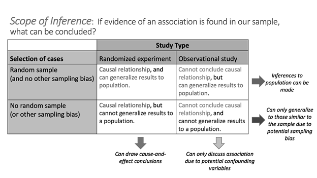

## Video Notes: Inference for Two Categorical Variables using Simulation-based Methods

Read Sections 2.2 - 2.4, 15.1, 15.2, Chapter 4 and Chapter 16 in the course textbook.  Use the following videos to complete the video notes for Module 8.

### Course Videos

* 1.2.3to1.2.5

* 2.2to2.4

* 4.1_TwoProp

* 4.2_TwoProp

* 4.4

* 15.1

* 15.2

* RelativeRisk

#### Relationships between variables - Video 1.2.3to1.2.5 {-}

Explanatory variable: predictor variable

* The variable researchers think *may be* _____________ 
the other variable.
    
* In an experiment, what the researchers _____________ or ________________.
    
* The groups that we are comparing from the data set.

Response variable: 

* The variable researchers think *may be* ___________________ by the other variable.

* Always simply ________________ or __________________; never controlled by researchers.

Examples:

Can you predict a criminal’s height based on the footprint left at the scene of a crime?

* Identify the explanatory variable:

\vspace{0.25in}

* Identify the response variable:

\vspace{0.25in}

Does marking an item on sale (even without changing the price) increase the number of units sold per day, on average?

* Identify the explanatory variable:

\vspace{0.25in}

* Identify the response variable:

\vspace{0.25in}

In the Physician's Health Study [@physhealth], male physicians participated in a study to determine whether taking a daily low-dose aspirin reduced the risk of heart attacks. The male physicians were randomly assigned to the treatment groups. After five years, 104 of the 11,037 male physicians taking a daily low-dose aspirin had experienced a heart attack while 189 of the 11,034 male physicians taking a placebo had experienced a heart attack. 

* Identify the explanatory variable:

\vspace{0.25in}

* Identify the response variable:

\vspace{0.25in}

#### Relationships between variables {-}

\setstretch{1.5}

* Association: the _____________ between variables create a pattern; knowing something about one variable tells us about the other.

    * Positive association: as one variable _____________, the other tends to _______________ also.
    
    * Negative association: as one variable _____________, the other tends to _____________.

* Independent: no clear pattern can be seen between the __________.


#### Observational studies, experiments, and scope of inference: Video 2.2to2.4 {-}

* Review

    - Explanatory variable: the variable researchers think *may be* affecting the other variable.
    
    - Response variable: the variable researchers think *may be* influenced by the other variable.

* Confounding variable: 
    - associated with both the explanatory and the response variable
    - explains the association shown by the data 

Example: 

\vspace{0.8in}

#### Study design {-}

* Observational study: 

\vspace{0.5in}

* Experiment: 

\vspace{0.5in}

Principles of experimental design

* Control: hold other differences constant across groups
\vspace{1mm}

* Randomization: randomized experiment
\vspace{1mm}

* Replication: large sample size or repeat of study
\vspace{1mm}

* Blocking: group based on certain characteristics
\vspace{1mm}

##### Optional Notes: Video Examples (Video 2.2to2.4) {-}
    
Example: It is well known that humans have more difficulty differentiating between faces of people from different races than people within their own race. A 2018 study published in the Journal of Experimental Psychology [@levin2000]: Human Perception and Performance investigated a similar phenomenon with gender. In the study, volunteers were shown several pictures of strangers. Half the volunteers were randomly assigned to rate the attractiveness of the individuals pictured. The other half were told to rate the distinctiveness of the faces seen. Both groups were then shown a slideshow of faces (some that had been rated in the first part of the study, some that were new to the volunteer) and asked to determine if each face was old or new. Researchers found people were better able to recognize faces of their own gender when asked to rate the distinctiveness of the faces, compared to when asked to rate the attractiveness of the faces.

* What is the study design?
    
\vspace{0.5in}


Example: In the Physician's Health Study [@physhealth], male physicians participated in a study to determine whether taking a daily low-dose aspirin reduced the risk of heart attacks. The male physicians were randomly assigned to the treatment groups. After five years, 104 of the 11,037 male physicians taking a daily low-dose aspirin had experienced a heart attack while 189 of the 11,034 male physicians taking a placebo had experienced a heart attack. 

* What is the study design?
    
\vspace{0.5in}

* Assuming these data provide evidence that the low-dose aspirin group had a lower rate of heart attacks than the placebo group, is it valid for the researchers to conclude the lower rate of heart attacks was caused by the daily low-dose aspirin regimen?

\vspace{0.5in}
    
#### Scope of Inference {-}

1. How was the sample selected?

* Random sample with no sampling bias:

\vspace{0.35in}

* Non-random sample with sampling bias:

\vspace{0.35in}

2. What is the study design?

* Randomized experiment:
    
\vspace{0.35in}

* Observational study:
    
\vspace{0.35in}

\newpage

Scope of Inference Table:

```{r, fig.align = "center", out.width="65%"}

```

Example: It is well known that humans have more difficulty differentiating between faces of people from different races than people within their own race. A 2018 study published in the Journal of Experimental Psychology [@levin2000]: Human Perception and Performance investigated a similar phenomenon with gender. In the study, volunteers were shown several pictures of strangers. Half the volunteers were randomly assigned to rate the attractiveness of the individuals pictured. The other half were told to rate the distinctiveness of the faces seen. Both groups were then shown a slideshow of faces (some that had been rated in the first part of the study, some that were new to the volunteer) and asked to determine if each face was old or new. Researchers found people were better able to recognize faces of their own gender when asked to rate the distinctiveness of the faces, compared to when asked to rate the attractiveness of the faces.

* What is the scope of inference for this study?

\vspace{0.5in}

\setstretch{1}

\newpage

### Summarizing two categorical variables - Video 4.1_TwoProp {-}

* The summary measure for two categorical variables is the ______________________ in _____________________________.

Notation used for the population difference in proportion:
    
* Two categorical variables:
    
\vspace{0.2in}

\rgi \rgi - Subscripts represent the __________________ variable groups
    
Notation used for the sample difference in proportion:
    
* Two categorical variables
    
\vspace{0.2in}

When we have two categorical variables we report the data in a  _______________ or two-way table with the _______________ variable on the columns and the ____________ variable on the rows.

\setstretch{1}

\vspace{2mm}

For today's videos we will again use the `moving_to_mt` data set.

Example from the Video:  Gallatin Valley is the fastest growing county in Montana.  You’ll often hear Bozeman residents complaining about the ‘out-of-staters’ moving in.  A local real estate agent recorded data on a random sample of 100 home sales over the last year at her company and noted where the buyers were moving from as well as the age of the person or average age of a couple buying a home.  The variable age was binned into two categories, "Under30" and "Over30." Additionally, the variable, state the buyers were moving from, was created as a binary variable, "Out" for a location out of state and "In" for a location in state.  

The following code reads in the data set, `moving_to_mt` and names the object moving.

```{r, echo=TRUE}
moving <- read.csv("data/moving_to_mt.csv")
```


To look at the relationship between the variable, `Age_Group` and the variable, `From` create the following two-way table using the `R` output below.  Note, we are using `From` as the explanatory variable to predict whether a home sale has a buyer that is over or under the age of 30.

```{r, echo=TRUE, collapse=FALSE}
moving %>%
    group_by(Age_Group) %>% count(From) %>% print(n=8)
```

\begin{center}
\begingroup
\setlength{\tabcolsep}{14pt} % Default value: 6pt
\renewcommand{\arraystretch}{2} % Default value: 1
\begin{tabular}{|c|c|c|c|c|c|}
\hline
 & \multicolumn{4}{|c|}{\textbf{State}} & \\ \hline
\textbf{Age Group} & CA & CO & MT & WA & Total \\ \hline
 Over30 & 6 & 2 & 47 & 10 & 65 \\ \hline
 Under30 & 6 & 6 & 14 & 9 & 35 \\ \hline
 Total & 12 & 8 & 61 & 19 & 100\\ \hline
\end{tabular}
\endgroup
\end{center}

* Using the table above, how many of the sampled home sales have buyers who were under 30 years old and from Montana?

\vspace{0.2in}

\setstretch{1.5}

If we want to know what proportion of each age group is from each state, we would calculate the proportion of home sales with buyers from each state within each age group. In other words, divide the number of home sales from each state with buyers that are over 30 by the total for row 1, the total number of home sales with buyers over 30.

\setstretch{1}

* What proportion of sampled home sales with buyers under 30-years-old were from California?

\vspace{0.3in}

* What notation should be used for this value?

\vspace{0.2in}

\setstretch{1.5}

Additionally, we could find the proportion of home sales with buyers in each state for each age group.  Here we would calculate the proportion of home sales with buyers in each age group within each state.  Divide the number of home sales with buyers in each age group from CA by the total for column 1, the total number of home sales with buyers from CA.

\setstretch{1}

\begin{center}
\begingroup
\setlength{\tabcolsep}{14pt} % Default value: 6pt
\renewcommand{\arraystretch}{2} % Default value: 1
\begin{tabular}{|c|c|c|c|c|c|}
\hline
 & \multicolumn{4}{|c|}{\textbf{State}} & \\ \hline
\textbf{Age Group} & CA & CO & MT & WA & Total \\ \hline
 Over30 & 6 & 2 & 47 & 10 & 65 \\ \hline
 Under30 & 6 & 6 & 14 & 9 & 35 \\ \hline
 Total & 12 & 8 & 61 & 19 & 100\\ \hline
\end{tabular}
\endgroup
\end{center}

* Using the table, calculate the proportion of home sales in Gallatin County with in-state buyers who are over 30 years old?  Use appropriate notation with informative subscripts.

\vspace{0.4in}

* Using the table, calculate the proportion of home sales in Gallatin County with California buyers who are over 30 years old?  Use appropriate notation with informative subscripts.

\vspace{0.4in}

* Calculate the difference in proportion of home sales in Gallatin County over 30 years old from other parts of Montana and from California. Use MT - CA as the order of subtraction.  Give appropriate notation.

\vspace{0.4in}

* Interpret the difference in proportion in context of the study.

\vspace{0.5in}

### Plots for two categorical variables - Video 4.2_TwoProp {-}

In a segmented bar plot, the bar for each category will sum to 1.  In this first plot, we are plotting the row proportions calculated conditional on the age group.

```{r, echo=TRUE, out.width="55%"}
moving %>%
  ggplot(aes(x = Age_Group, fill = From))+ #Enter the variables to plot
  geom_bar(stat = "count", position = "fill") +
  labs(title = "Segmented bar plot of Age Group of Buyers by State of
       Origin for Gallatin County Home Sales",
       #Title your plot
       y = "Relative Frequency", #y-axis label
       x = "Age Group") + #x-axis label
  scale_fill_grey()
```

In this second plot, we are plotting the column proportions calculated conditional on the state of origin for the buyer.

```{r, echo=TRUE, out.width="55%"}
moving %>%
  ggplot(aes(x = From , fill = Age_Group))+ #Enter variables to plot
  geom_bar(stat = "count", position = "fill") +
  labs(title = "Segmented bar plot of State of Origin of Buyers by Age
       Group for Gallatin County Home Sales",
       #Title your plot
       y = "Relative Frequency", #y-axis label
       x = "State of Origin") + #x-axis label
  scale_fill_grey()
```

Mosaic plot:
```{r, echo=TRUE, warning=FALSE, out.width="75%"}
moving$Age_Group <- factor(moving$Age_Group, levels = c("Under30", "Over30"))
moving %>% # Data set piped into...
  ggplot() +   # This specifies the variables
  geom_mosaic(aes(x=product(From), fill = Age_Group)) +
    # Tell it to make a mosaic plot
  labs(title = "Mosaic plot of State of Origin Segmented by
  Age Group for Gallatin County Home Sales",
       # Title your plot
       x = "State of Origin",   # Label the x axis
       y = "") +  # Remove y axis label
    scale_fill_grey(guide = guide_legend(reverse = TRUE)) # Make figure color
```

* Why is the bar for MT the widest on the mosaic plot?

\vspace{0.2in}

\newpage

#### Simpson's paradox - Video 4.4 {-}

\setstretch{1.5}

* When an apparent _____________ between explanatory and response variables reverses when accounting for ______________ variable.

\setstretch{1}

Example: The "Berkeley Dataset" contains all 12,763 applicants to UC-Berkeley's graduate programs in Fall 1973. This dataset was published by UC Berkeley researchers in an analysis to understand the possible gender bias in admissions and has now become a classic example of Simpson's Paradox.

```{r, echo=TRUE, out.width="85%"}
discrim <- read.csv ("data/berkeley.csv")

discrim %>%
  ggplot(aes(x =Gender, fill = Admission))+
  geom_bar(stat = "count", position = "fill") +
  labs(title = "Segmented bar plot of Sex of Berkley Applicants by
       Admission Status",
       y = "Relative Frequency",
       x = "Sex") +
  scale_fill_grey()
```

The data showed that 44\% of male applicants were accepted and 35\% of female applicants were accepted.  Does it appear that the female students are discriminated against?

\vspace{0.1in}

We can break down the data by major.  A major code (either A, B, C, D, E, F, or Other) was used.

\newpage

Here we look at the relationship between admission status and sex for Program A and for Program B.

```{r, out.width="85%"}

```

Showing Program C and Program D.

```{r, out.width="85%"}
include_graphics("images/SimPara_cD.png")
```

And finally, Program E and F.

```{r, out.width="85%"}
include_graphics("images/SimPara_EF.png")
```

We can see in several programs the acceptance rate is actually HIGHER for females than for males.

\vspace{1in}

\newpage


### Simulation Testing for a Difference in Proportions - Video 15.1 {-}

\setstretch{1.5}

* In this module, we will study inference for a ______________________ explanatory variable and a _________________________ response.


\setstretch{1}

Example: In a double-blind experiment [@Weiss1988] on 48 cocaine addicts hoping to overcome their addiction, half were randomly assigned to a drug called desipramine and the other half a placebo.  The addicts were followed for 6 weeks to see whether they were still clean.  Is desipramine more effective at helping cocaine addicts overcome their addiction than the placebo?

Observational units: 

\vspace{0.15in}

Explanatory variable:

\vspace{0.15in}

Response variable:

\vspace{0.15in}

\setstretch{1.5}

Notation:

* Population proportion for group 1:

* Population proportion for group 2:

* Sample proportion for group 1:

* Sample proportion for group 2:

* Sample difference in proportions: 

* Sample size for group 1:

* Sample size for group 2:

\setstretch{1}

### Hypothesis Testing {-}

Conditions:

* Independence: the response for one observational unit will not influence another observational unit

Null hypothesis assumes “no effect”, “no difference”, “nothing interesting happening”, etc.

\rgi Always of form:  “parameter” = null value

$H_0:$

\vspace{0.2in}

$H_A:$

\vspace{0.2in}

* Research question determines the direction of the alternative hypothesis.

\newpage

##### Optional Notes: Video Example (Video 15.1) {-}

Write the null and alternative hypotheses for the cocaine study:

In notation:

$H_0:$

\vspace{0.2in}

$H_A:$

\vspace{0.2in}

#### Summary statistics and plot {-}

```{r}
outcome<-c(rep("clean", 14), rep("relapsed", 10), rep("clean", 4), rep("relapsed", 20))
drug<-c(rep("desipramine", 24), rep("placebo", 24))
cocaine<-data.frame(cbind(drug,outcome))
```

```{r, echo=TRUE, collapse=FALSE}
cocaine %>% group_by(drug) %>% count(outcome)
```
Summary statistic:

\vspace{0.3in}

Interpretation:

\vspace{0.4in}

```{r, echo=TRUE ,out.width="60%"}
cocaine%>%
  ggplot(aes(x = drug, fill = outcome))+
  geom_bar(stat = "count", position = "fill") +
  labs(title = "Bar plot of Type of Drug, Segmented by 
       Outcome for Cocaine Addicts",
       y = "Relative Frequency",
       x = "Drug or Placebo") +
    scale_fill_grey()
```

Is the independence condition met for simulation inference?

\vspace{0.4in}

#### Simulation-based method {-}

* Simulate many samples assuming $H_0: \pi_1 = \pi_2$

    * Write the response variable values on cards

    * Mix the explanatory variable groups together
    
    * Shuffle cards into two explanatory variable groups to represent the sample size in each group ($n_1$ and $n_2$)

    * Calculate and plot the simulated difference in sample proportions from each simulation

    * Repeat 10000 times (simulations) to create the null distribution

    * Find the proportion of simulations at least as extreme as $\hat{p}_1 - \hat{p}_2$
    
```{r, echo=TRUE, eval=TRUE}
set.seed(216)
two_proportion_test(formula = outcome~drug, # response ~ explanatory
    data = cocaine, # Name of data set
    first_in_subtraction = "desipramine", # Order of subtraction: enter the name of Group 1
    number_repetitions = 10000, # Always use a minimum of 10000 repetitions
    response_value_numerator = "clean", # Define which outcome is a success
    as_extreme_as = 0.417, # Calculated observed statistic (difference in sample proportions)
    direction="greater") # Alternative hypothesis direction ("greater","less","two-sided")
```

Explain why the null distribution is centered at the value of zero:

\vspace{1in}

\newpage

Interpretation of the p-value:

* Statement about probability or proportion of samples

* Statistic (summary measure and value)
    
* Direction of the alternative 
    
* Null hypothesis (in context) 

\vspace{0.8in}

Conclusion with scope of inference: 

* Amount of evidence
    
* Parameter of interest 
    
* Direction of the alternative hypothesis

* Generalization

* Causation

\vspace{0.8in}

\newpage

### Confidence interval for a Difference in Proportion - Video 15.2 {-}

To estimate the difference in true proportion we will create a confidence interval.

#### Simulation-based method {-}

* Write the response variable values on cards

* Keep explanatory variable groups separate
    
* Sample with replacement $n_1$ times in explanatory variable group 1 and $n_2$ times in explanatory variable group 2

* Calculate and plot the simulated difference in sample proportions from each simulation

* Repeat 10000 times (simulations) to create the bootstrap distribution

* Find the cut-offs for the middle X\% (confidence level) in a bootstrap distribution.

##### Optional Notes: Video Example (Video 15.2)

Returning to the cocaine example, we will estimate the difference in true proportion of cocaine addicts that stay clean for those on the desipramine and those on the placebo.

```{r, echo=TRUE, eval=TRUE}
set.seed(216)
two_proportion_bootstrap_CI(formula = outcome ~ drug, 
        data=cocaine, # Name of data set
        first_in_subtraction = "desipramine", # Order of subtraction: enter the name of Group 1
        response_value_numerator = "clean", # Define which outcome is a success 
        number_repetitions = 10000, # Always use a minimum of 10000 repetitions
        confidence_level = 0.99) # Enter the level of confidence as a decimal
```

Confidence interval interpretation:

* How confident you are (e.g., 90%, 95%, 98%, 99%)
    
* Parameter of interest
    
* Calculated interval
    
* Order of subtraction when comparing two groups

\vspace{0.8in}

### Relative Risk - Video RelativeRisk {-}

* Relative risk is the ratio of the risks in two different categories of an explanatory variable.

Relative Risk:

\vspace{0.3in}

Example: In a study reported in the New England Journal of Medicine [@doit2015], one-hundred fifty (150) children who had shown sensitivity to peanuts were randomized to receive a flour containing a peanut protein or a placebo flour for 2.5 years. At age 5 years, children were tested with a standard skin prick to see if they had an allergic reaction to peanut protein (yes or no). 71% of those in the peanut flour group no longer demonstrated a peanut allergy compared to 2% of those in the placebo group.

* Calculate the relative risk of desensitization comparing the peanut flour group to the placebo group.

\vspace{0.8in}

\setstretch{1.5}

* Interpretation:

    * The proportion of successes in group 1 is the $RR$ ________________ the proportion of successes in group 2.

Increase in risk:

\vspace{0.3in}

* Interpretation:

    * The proportion of successes in group 1 is the $(RR-1)$ ______________
higher/lower than the proportion of successes in group 2.

Percent increase in risk:

\vspace{0.3in}

* Interpretation:

    * The proportion of successes in group 1 is the $(RR-1)\times 100$ __________ higher/lower than the proportion of successes in group 2.

\setstretch{1}

* Interpret the value of relative risk from the peanut study in context of the problem.

\vspace{0.6in}

* Find the increase (or decrease) in risk of desensitization and interpret this value in context of the problem.

\vspace{1in}

* Find the percent increase (or decrease) in risk of desensitization and interpret this value in context of the problem.

\vspace{1in}

##### Optional Notes: Video Example (Video RelativeRisk) {-}

Within the peanut flour group, the percent desensitized within each age group (at start of study) is as follows:

1-year-olds: 71\%; 2-year-olds: 35\%; 3-year-olds: 19\%

* Calculate the relative risk of desensitization comparing the 3 year olds to the 2 year olds within the peanut flour group.

\vspace{0.8in}

* Interpret the percent increase (or decrease) in risk of desensitization comparing the 3 year olds to the 2 year olds within the peanut flour group.

\vspace{0.8in}

#### Relative risk in the news {-}

People 50 and older who have had a mild case of covid-19 are 15\% more likely to develop shingles (herpes zoster) within six months than are those who have not been infected by the coronavirus, according to research published in the journal Open Forum Infectious Diseases [@bhavsar2022].

* What was the calculated relative risk of developing shingles when comparing those who has mild COVID-19 to those who had not had COVID-19, among the 50 and older population?

\vspace{0.8in}

#### Testing Relative Risk {-}

In Unit 2, we tested for a difference in proportion.  We could also test for relative risk.

\setstretch{1.5}

Null Hypothesis:

$H_0:$

\vspace{0.2in}

Alternative Hypothesis:

$H_A:$

\vspace{0.2in}

\setstretch{1}


### Concept Check

Be prepared for group discussion in the next class. One member from the table should write the answers to the following on the whiteboard.

1. Explain why the null distribution is centered at the value of zero.

\vspace{0.5in}

2. Does the confidence interval agree with the p-value?

\vspace{0.5in}

3. What is the difference between a mosaic plot and a segmented bar plot?

\vspace{0.5in}

4. What does relative risk measure?
\newpage
