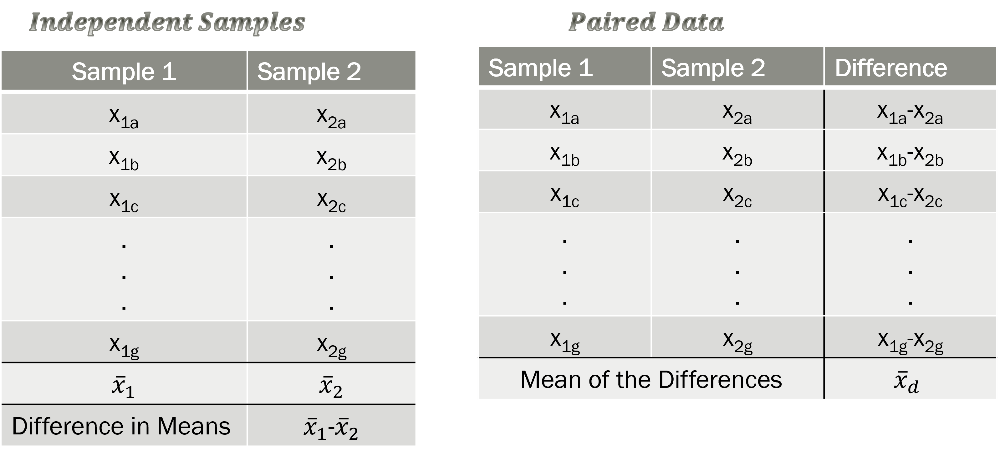

## Video Notes: Inference for Paired Data 

Read Chapters 17 and 18 in the course textbook.  Use the following videos to complete the video notes for Module 9.

### Course Videos

* PairedData

* 18.1and18.2

* 18.3

\setstretch{1}


### Single categorical, single quantitative variables Video Paired_Data {-}

* In this module, we will study inference for a ______________________ explanatory variable and a _________________________ response variable where the two groups are ____________________________.

### Paired vs. Independent Samples {-}

Two groups are paired if an observational unit in one group is connected to an observational unit in another group 
	
\rgi Data are paired if the samples are ___________________
	
Examples: 

* Change in test score from pre and post test

* Weight of college students before and after 1st year

* Change in blood pressure

```{r pairedindependent, fig.cap="Illustration of Independent vs. Paired Samples", out.width="60%"}

```

Example 1:  Three hundred registered voters were selected at random to participate in a study on attitudes about how well the president is performing. They were each asked to answer a short multiple-choice questionnaire and then they watched a 20-minute video that presented information about the job description of the president. After watching the video, the same 300 selected voters were asked to answer a follow-up multiple-choice questionnaire. 

* Is this an example of a paired samples or independent samples study?

\vspace{0.3in}

\newpage

Example 2: Thirty dogs were selected at random from those residing at the humane society last month. The 30 dogs were split at random into two groups. The first group of 15 dogs was trained to perform a certain task using a reward method. The second group of 15 dogs was trained to perform the same task using a reward-punishment method. 

* Is this an example of a paired samples or independent samples study?

\vspace{0.3in}

Example 3: Fifty skiers volunteered to study how different waxes impacted their downhill race times. The participants were split into groups of two based on similar race times from the previous race. One of the two then had their skis treated with Wax A while the other was treated with Wax B. The downhill ski race times were then measured for each of the 25 volunteers who used Wax A as well as for each of the 25 volunteers who used Wax B.

* Is this an example of a paired samples or independent samples study?

\vspace{0.3in}

Example: Is there a difference in heights between husbands and wives?  The heights were measured on the husband and wife in a random sample of 199 married couples from Great Britain [@gbmarried]. 

For a paired experiment, we look at the difference between responses for each unit (pair), rather than just the average difference between treatment groups


```{r, echo=TRUE}
hw <-read.csv("data/husbands_wives_ht.csv")
paired_observed_plot(hw)
```

```{r, echo=FALSE}
hw_diff <- hw %>%
  select(ht_husband, ht_wife) %>%
  mutate(ht_diff = ht_husband-ht_wife)
```

<!-- ```{r, echo=TRUE, collapse=FALSE} -->
<!-- hw_diff %>% -->
<!--     summarise(favstats(ht_husband)) -->
<!-- ``` -->

<!-- ```{r, echo=TRUE, collapse=FALSE} -->
<!-- hw_diff %>% -->
<!--     summarise(fav_stats(ht_wife)) -->
<!-- ``` -->

```{r, echo=TRUE, collapse=FALSE}
hw_diff %>%
    summarise(fav_stats(ht_diff))
```

\setstretch{1.5}

* The summary measure for paired data is the _______________________.

\newpage

* Mean difference: the average _______________ in the _________________ 
variable outcomes for observational units between ____________________ variable groups

\setstretch{1}

Notation for the Paired differences

* Population mean of the differences:

* Population standard deviation of the differences:

* Sample mean of the differences: 

* Sample standard deviation of the differences: 

Conditions for inference for paired data:

- Independence:

\vspace{0.5in}

Is the independence condition met for the height study?

\vspace{0.5in}
	
### Hypothesis testing {-}

Null hypothesis assumes “no effect”, “no difference”, “nothing interesting happening”, etc.

* Treat the differences like a single mean

* Always of form:  “parameter” = null value

$H_0:$

\vspace{0.2in}

$H_A:$

\vspace{0.2in}

* Research question determines the direction of the alternative hypothesis.

Write the null and alternative for the height study:

In notation:

$H_0:$

\vspace{0.2in}

$H_A:$

\vspace{0.2in}

#### Simulation-based method {-}

* Simulate many samples assuming $H_0: \mu_d = 0$

    * Shift the data by the difference between $\mu_0$ and $\bar{x}_d$

    * Sample with replacement $n$ times from the shifted data

    * Plot the simulated shifted sample mean from each simulation

    * Repeat 1000 times (simulations) to create the null distribution

    * Find the proportion of simulations at least as extreme as $\bar{x}_d$
    
Reminder of summary statistics:

```{r, echo=TRUE, collapse=FALSE}
hw_diff %>%
    summarise(fav_stats(ht_diff))
```

Find the difference:

$\mu_0 - \bar{x}_d =$


Simulated null distribution:

```{r, echo=TRUE, warning=FALSE}
set.seed(216)
paired_test(data = hw_diff$ht_diff,   # Vector of differences 
                                         # or data set with column for each group
            shift = -130.543,   # Shift needed for bootstrap hypothesis test
            as_extreme_as = 130.543,  # Observed statistic
            direction = "two-sided",  # Direction of alternative
            number_repetitions = 1000,  # Number of simulated samples for null distribution
            which_first = 1)  # Not needed when using calculated differences
```
Interpret the p-value:

* Statement about probability or proportion of samples

* Statistic (summary measure and value)
    
* Direction of the alternative 
    
* Null hypothesis (in context) 

\vspace{0.8in}

\newpage 

Conclusion: 

* Amount of evidence
    
* Parameter of interest 
    
* Direction of the alternative hypothesis

\vspace{0.8in}


### Confidence interval {-}

#### Simulation-based method{-}

* Label cards with the values (differences) from the data set

* Sample with replacement (bootstrap) from the original sample $n$ times

* Plot the simulated sample mean on the bootstrap distribution

* Repeat at least 1000 times (simulations)

* Find the cut-offs for the middle X% (confidence level) in a bootstrap distribution.

    * i.e., 95\% CI = (2.5th percentile, 97.5th percentile)

Simulated bootstrap distribution:

```{r, echo=TRUE, warning=FALSE}
set.seed(216)
paired_bootstrap_CI(data = hw_diff$ht_diff, # Enter vector of differences
            number_repetitions = 1000, # Number of bootstrap samples for CI
            confidence_level = 0.95,  # Confidence level in decimal form
            which_first = 1)  # Not needed when entering vector of differences
```

\newpage

Interpret the 99\% confidence interval:

* How confident you are (e.g., 90%, 95%, 98%, 99%)
    
* Parameter of interest
    
* Calculated interval
    
* Order of subtraction when comparing two groups

\vspace{0.8in}

#### Theory-based method - Video 18.3 {-}

#### t-distribution {-}

In the theoretical approach, we use the CLT to tell us that the distribution of sample means will be approximately normal, centered at the assumed true mean under $H_0$ and with standard deviation $\frac{\sigma}{\sqrt{n}}$.

$$\bar{x} \sim N(\mu_0, \frac{\sigma_d}{\sqrt{n}})$$
\setstretch{1.5}

* Estimate the population standard deviation, $\sigma_d$, with the
___________________________ standard deviation, ________.

* For a single quantitative variable we use the ____ - distribution
with _______________
degrees of freedom to approximate the sampling distribution.

\setstretch{1}

Conditions for inference using theory-based methods for paired data (categorical explanatory and quantitative response):

- Independence: (same as for simulation); the difference in outcome for one observational unit will not influence another observation.

- Large enough sample size:

    - Normality: The data should be approximately normal or the sample size should be large.

\rgi \rgi $n < 30$: 
    
\vspace{0.2in}

\rgi \rgi $30 \leq n < 100$: 
    
\vspace{0.2in}

\rgi \rgi $n \geq 100$: 
    
\vspace{0.2in}

Theory-based Hypothesis Test:

* Calculate the standardized statistic 

* Find the area under the t-distribution with $n - 1$ df at least as extreme as the standardized statistic

Equation for the standard error for the sample mean difference:

\vspace{0.5in}

Equation for the standardized sample mean difference:

\vspace{0.5in}

Reminder of summary statistics for height data:
```{r, echo=TRUE, collapse=FALSE}
hw_diff %>%
    summarise(fav_stats(ht_diff))
```

Calculate the standardized sample mean difference in height:

* 1st calculate the standard error of the sample mean difference

\vspace{0.5in}

* Then calculate the T score

\vspace{0.5in}

What theoretical distribution should we use to find the p-value using the value of the standardized statistic?

\vspace{0.3in}

```{r, pvalueheight, echo = F}

x <- seq(-4, 4, length=100)
hx<-dt(x, 198)
degf <- 198

plot(x, hx, type="l", lty=1, lwd=3, xlab="",
  ylab="Density", main="t-distribution with 198 df")

```

To find the p-value:

```{r, echo=TRUE, collapse=FALSE}
pt(24.84, df = 198, lower.tail=FALSE)*2
```


Theory-based Confidence Interval:

\rgi $\text{statistic} \pm \text{margin of error}$

\vspace{0.5in}


The $t^*$ multiplier is the value at the given percentile of the t-distribution with $n - 1$ degrees of freedom.

For the height data, we will use a t-distribution with _________ df.

```{r, tstar, echo = F}

x <- seq(-4, 4, length=100)
hx<-dt(x, 198)
degf <- 198

plot(x, hx, type="l", lty=1, lwd=3, xlab="",
  ylab="Density", main="t-distribution with 198 df")

```

To find the $t^*$ multiplier for a 99\% confidence interval:

```{r, echo=TRUE, collapse=FALSE}
qt(0.975, df=198, lower.tail = TRUE)
```

Calculate the margin of error:
\vspace{0.4in}

Calculate the theory-based confidence interval.
\vspace{0.5in}


### Concept Check

Be prepared for group discussion in the next class. One member from the table should write the answers to the following on the whiteboard.

1. What theoretical distribution is used to approximate paired quantitative data?

\vspace{0.2in}

2. What is the difference between a paired and independent study design?

\vspace{1in}

\newpage
