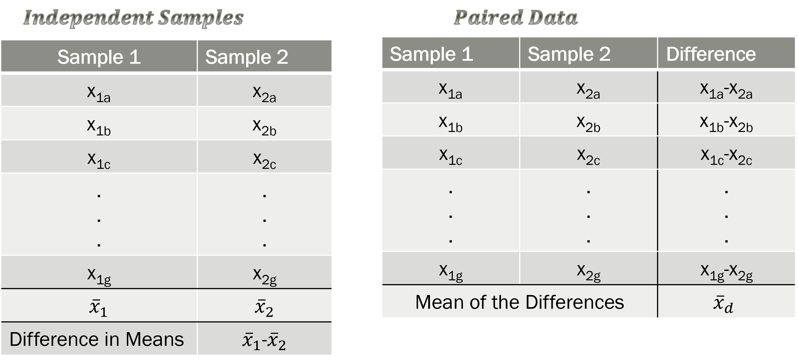

## Video Notes: Inference for Paired Data 

Read 18 in the course textbook.  Use the following videos to complete the video notes for Module 12.

### Course Videos

* Paired_Data

* Simulation_Inference_Paired_Data

* Theoretical_Inference_Paired_Data


\setstretch{1}


### Video: Paired Data (introduction to Chapter 18) {-}

\setstretch{1.5}

* In this module, we will study a ______________________ explanatory variable and a _________________________ response variable where the two groups are ____________________________.

### Paired vs. Independent Samples {-}

Two groups are paired if an observational unit in one group is connected to an observational unit in another group 
	
\rgi Data are paired if the samples are ___________________
	
\rgi \rgi - Most often occurs if an observational unit is measured __________________ 

\rgi \rgi - Other paired designs: Matched pairs

```{r pairedindependent, fig.cap="Illustration of Independent vs. Paired Samples", out.width="60%"}

```

Example 1:  Three hundred registered voters were selected at random to participate in a study on attitudes about how well the president is performing. They were each asked to answer a short multiple-choice questionnaire and then they watched a 20-minute video that presented information about the job description of the president. After watching the video, the same 300 selected voters were asked to answer a follow-up multiple-choice questionnaire. 

* Is this an example of a paired samples or independent samples study?

\vspace{0.3in}

 

Example 2: Thirty dogs were selected at random from those residing at the humane society last month. The 30 dogs were split at random into two groups. The first group of 15 dogs was trained to perform a certain task using a reward method. The second group of 15 dogs was trained to perform the same task using a reward-punishment method. 

* Is this an example of a paired samples or independent samples study?

\vspace{0.3in}

Example 3: Fifty skiers volunteered to study how different waxes impacted their downhill race times. The participants were split into groups of two based on similar race times from the previous race. One of the two then had their skis treated with Wax A while the other was treated with Wax B. The downhill ski race times were then measured for each of the 25 volunteers who used Wax A as well as for each of the 25 volunteers who used Wax B.

* Is this an example of a paired samples or independent samples study?

\vspace{0.3in}

* The summary measure for paired data is the ______________ _________________

\setstretch{1.5}

\rgi \rgi - The mean difference found by taking the difference in the _________________ variable measurements between the two paired observations, then finding the ____________________________ of those differences.

\setstretch{1}

Notation for the paired differences

* Parameter: Population mean of the differences:

* Statistic: Sample mean of the differences: 

* Population standard deviation of the differences:

* Sample standard deviation of the differences: 

* Sample size of the differences (or number of pairs):

### Video: Simulation Inference for Paired Data (sections 18.1 and 18.2) {-}

Conditions for simulation inference for paired data:

- Independence:

\vspace{0.5in}

	
#### Hypothesis testing {-}

Null hypothesis assumes “no effect”, “no difference”, “nothing interesting happening”, etc.

* Treat the differences like a single mean

* Always of form:  “parameter” = null value

$H_0:$

\vspace{0.2in}

$H_A:$

\vspace{0.2in}

* Research question determines the direction of the alternative hypothesis.

#### Simulation-based Hypothesis Tests {-}

* Simulate many samples assuming $H_0: \mu_d = 0$

* Shift the data by the difference between __________ and _____________.  Label cards with these shifted values.

* Sample with replacement ___________ times from the shifted data

* Plot the simulated shifted sample ______________________________ from each simulation

* Repeat 10000 times (simulations) to create the ________________ distribution

* Find the proportion of simulations at least as extreme as _____________________
    
#### Simulation-based Confidence Intervals {-}

* Label cards with the values from the _______________ _________________

* Sample with replacement (bootstrap) from the original sample differences _____________ times

* Plot the simulated sample _______________ _______________ from each simulation

* Repeat at least 10000 times (simulations) to create the ________________ distribution

* Find the cut-offs for the middle X% (confidence level) in a bootstrap distribution.


#### Optional Notes: Additional Example {-}


Example: Is there a difference in heights between husbands and wives?  The heights were measured on the husband and wife in a random sample of 199 married couples from Great Britain [@gbmarried]. Use husband - wife as the order of subtraction.

Observational units: 

\vspace{0.2in}

Response variable (include: units of measure):

\vspace{0.2in}

Explanatory variable (include: what is group 1?): 

\vspace{0.2in}

Why should these data be treated as paired?

\vspace{0.4in}

Define the parameter in words and write it using proper notation.

\vspace{0.5in}

Write the null and alternative hypothesis in notation:

$H_0:$

\vspace{0.2in}

$H_A:$

\vspace{0.2in}
    
Is the independence condition met for the height study?

\vspace{0.5in}


```{r, echo=TRUE}
hw <-read.csv("data/husbands_wives_ht.csv")
paired_observed_plot(hw)
```

```{r, echo=FALSE}
hw_diff <- hw %>%
  select(ht_husband, ht_wife) %>%
  mutate(ht_diff = ht_husband-ht_wife)
```

Summary statistics for height data:
```{r, echo=TRUE, collapse=FALSE}
hw_diff %>%
    summarise(fav_stats(ht_diff))
```

Write the value of the statistic.  Use proper notation: 

\vspace{0.2in}

How much would the data need to be shifted in order to assume the null hypothesis is true?  Find the difference:

$\mu_0 - \bar{y} =$


Null distribution:

```{r, echo=TRUE, warning=FALSE}
set.seed(216)
paired_test(data = hw_diff$ht_diff,   # Vector of differences 
                                         # or data set with column for each group
            shift = -130.543,   # Shift needed for bootstrap hypothesis test
            as_extreme_as = 130.543,  # Observed statistic
            direction = "two-sided",  # Direction of alternative
            number_repetitions = 10000,  # Number of simulated samples for null distribution
            which_first = 1)  # Not needed when using calculated differences
```

Where are the red lines plotted on the null distribution?  Explain why both values are important.

\vspace{0.4in}


What is the p-value of the test?

\vspace{0.2in}

Interpretation of the p-value:

* Statement about probability or proportion of samples

* Statistic (summary measure and value) and Direction of the alternative 
    
* Null hypothesis (population reference, summary measure, equal to null value)

* Context of the problem (observational units, variables (for paired data, include: both explanatory variable "groups"/measurements, units of measure of the response variable, and order of subtraction))

\vspace{0.8in}

Conclusion with scope of inference: 

* Amount of evidence
    
* For the alternative hypothesis (population reference, summary measure, direction, null value)

* Context of the problem (observational units, variables (for paired data, include: both explanatory variable "groups"/measurements, units of measure of the response variable, and order of subtraction))

* Generalization

* Causation

\vspace{0.8in}


Bootstrap distribution:

```{r, echo=TRUE, warning=FALSE}
set.seed(216)
paired_bootstrap_CI(data = hw_diff$ht_diff, # Enter vector of differences
            number_repetitions = 10000, # Number of bootstrap samples for CI
            confidence_level = 0.98,  # Confidence level in decimal form
            which_first = 1)  # Not needed when entering vector of differences
```

Interpret the 98\% confidence interval:

Confidence interval interpretation:

* How confident you are (e.g., 90%, 95%, 98%, 99%)
    
* Parameter of interest (including context: observational units, variables (for paired data, include: both explanatory variable "groups"/measurements, units of measure of the response variable, and order of subtraction))
    
* Calculated interval

\vspace{0.8in}


### Video: Theory-Based Inference for Paired Data (section 18.3) {-}

Conditions to use theory-based inference for paired data:

* **Independence**: 

\vspace{0.6in}

* **Normality Condition**: 

\vspace{1in}

#### t-distribution {-}

In the theoretical approach, we use the CLT to tell us that the distribution of a sample mean difference will be approximately normal, centered at the assumed true mean difference under $H_0$ and with standard deviation $\frac{\sigma_d}{\sqrt{n}}$.

$$\bar{y_d} \sim N(\mu_0, \frac{\sigma_d}{\sqrt{n}})$$
\setstretch{1.5}

* Estimate the population standard deviation, $\sigma_d$, with the ___________________________ standard deviation, ________.

* For paired data (similar to a single quantitative variable) we use the ____ - distribution with _______________ degrees of freedom to approximate the sampling distribution.

\setstretch{1}

#### Hypothesis Testing

Equation for the standard error of the sample mean difference:

\vspace{0.5in}

Equation for the standardized sample mean difference:

\vspace{0.5in}


General steps of a hypothesis test

1.	Write a research question and hypotheses.

2.	Collect data and calculate a summary statistic.

3.	Model a sampling distribution which assumes the null hypothesis is true.

\rgi \rgi - If the conditions are met, the sampling distribution of a sample mean difference which assumes the null hypothesis is true is the $t$-distribution with $n-1$ degrees of freedom

4.	Calculate a p-value.

\rgi \rgi - Calculate the standardized sample mean difference ($T$) and compare that to the $t$-distribution with $n-1$ degrees of freedom.
\rgi \rgi - P-value will be the area under the curve beyond $T$ (in the direction of the alternative hypothesis)

5.	Draw conclusions based on a p-value.


#### Confidence Intervals

General formula for a confidence interval is always:

\rgi \rgi $\text{statistic} \pm \text{margin of error}$

\rgi \rgi where $\text{margin of error} = \text{multiplier} \times \text{standard error of the statistic}$

For paired data,

* $\text{statistic}$ = ___________

* $\text{margin of error} = \text{multiplier} \times \text{standard error of the statistic} = $ ____________ $\times$ ______________

The formula for the standard error of the mean difference is the same as was used for a hypothesis test: $SE(\overline{y_d}) = \frac{s_d}{\sqrt{n}}$

The $t^*$ multiplier is the value at the given percentile(s) of the t-distribution with $n- 1$ degrees of freedom.

#### Optional Notes: Additional Example {-}


Here are a few reminders of the height data from the previous video:


```{r, echo=TRUE}
hw <-read.csv("data/husbands_wives_ht.csv")
paired_observed_plot(hw)
```

```{r, echo=FALSE}
hw_diff <- hw %>%
  select(ht_husband, ht_wife) %>%
  mutate(ht_diff = ht_husband-ht_wife)
```

Summary statistics for height data:
```{r, echo=TRUE, collapse=FALSE}
hw_diff %>%
    summarise(fav_stats(ht_diff))
```

Calculate the standard error of the sample mean difference:

\vspace{0.5in}

Calculate the standardized sample mean difference in height (standardized statistic):

\vspace{0.5in}

What theoretical distribution should we use to find the p-value using the value of the standardized statistic?

\vspace{0.3in}

Label the standardized sample mean difference (standardized statistic) on the theoretical distribution below and shade the area representing the p-value.

```{r, tstarpb2, echo = F}

x <- seq(-5, 5, length=100)
hx<-dt(x, 198)
degf <- 198

plot(x, hx, type="l", lty=1, lwd=3, xlab="",
  ylab="Density", main="t-distribution with 198 df")
```

To find the p-value:

```{r, echo=TRUE, collapse=FALSE}
pt(24.84, df = 198, lower.tail=FALSE)*2
```


To find the confidence interval:

First, use `R` to find the $t^*$ multiplier for a 98\% confidence interval:

```{r, echo=TRUE, collapse=FALSE}
qt(0.99, df=198, lower.tail = TRUE)
```


Draw a line at the provided $t^\star$ on the $t$-distribution with 198 degrees of freedom shown below, and label the percentile of the $t^\star$ value.  


```{r, tstar, echo = TRUE}

x <- seq(-4, 4, length=100)
hx<-dt(x, 198)
degf <- 198

plot(x, hx, type="l", lty=1, lwd=3, xlab="",
  ylab="Density", main="t-distribution with 198 df")

```


* We will use the same value for $SE(\bar{y}_d)$ as calculated for the standardized statistic.

Calculate the margin of error for a 98\% confidence interval for the parameter of interest.

\vspace{0.5in}

Calculate a 98\% confidence interval for the parameter of interest.

\vspace{0.6in}

Does your confidence interval and p-value agree?

\vspace{0.5in}


### Concept Check

Be prepared for group discussion in the next class. One member from the table should write the answers to the following on the whiteboard.

1. What theoretical distribution is used to approximate paired quantitative data?

\vspace{0.2in}

2. What is the difference between a paired and independent study design?

\vspace{1in}

 
\newpage