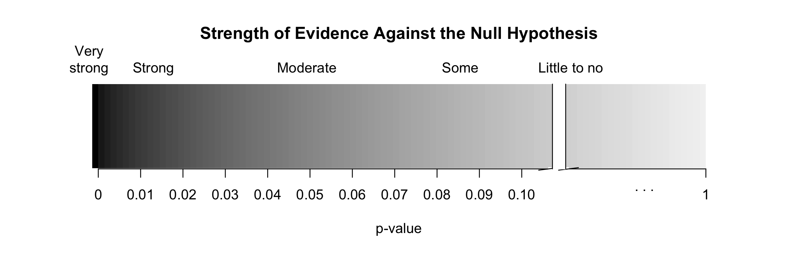

---
output:
  pdf_document: default
  html_document: default
---
## Module 3 Extra Review:  Sleep Study --- Simulation-based Inference Methods

```{r setup, include=FALSE}
knitr::opts_chunk$set(
  comment = "#>",
  collapse = TRUE,
  message = FALSE,
  #cache = TRUE,
  echo = FALSE, # hide code unless otherwise noted in chunk options
  out.width = "70%",
  fig.align = 'center',
  fig.width = 6,
  fig.asp = 0.618,  # 1 / phi
  fig.show = "hold",
  message = FALSE
  )
options(show.signif.stars = FALSE)
suppressMessages(library(knitr))
suppressMessages(library(tidyverse))
suppressMessages(library(car))
suppressMessages(library(readr))
suppressMessages(library(catstats))

colorize <- function(x, color="red") {
  if (knitr::is_latex_output()) {
    sprintf("\\textcolor{%s}{%s}", color, x)
  } else if (knitr::is_html_output()) {
    sprintf("<span style='color: %s;'>%s</span>", color,
            x)
  } else x
}
```

### Steps of the statistical investigation process

We will work through a five-step process to complete a hypothesis test for a single proportion, first introduced in the activity in week 1.

* **Ask a research question** that can be addressed by collecting data. What are the researchers trying to show?

* **Design a study and collect data**. This step involves selecting the people or objects to be studied and how to gather relevant data on them.

* **Summarize and visualize the data**. Calculate summary statistics and create graphical plots that best represent the research question.

* **Use statistical analysis methods to draw inferences from the data**. Choose a statistical inference method appropriate for the data and identify the p-value and/or confidence interval after checking assumptions. In this study, we will focus on using randomization to generate a simulated p-value.

* **Communicate the results and answer the research question**. Using the p-value and confidence interval from the analysis, determine whether the data provide statistical evidence against the null hypothesis. Write a conclusion that addresses the research question.

### Sleep Study

The Gallup Poll reports that 59% of Americans get seven or more hours of sleep at night.  Recent research [@wahlstrom2014] on the sleep-wake cycle of teenagers has indicated that biological changes associated with puberty may lead adolescents to require more sleep and feel sleepier at later times. One external factor that can impact their sleep is the early start time of high school. A study was conducted, involving a random sample of 446 students from public schools across three different states, to investigate whether these students sleep for at least 7 hours daily. The results revealed that 296 students sleep for at least 7 hours daily, while 150 sleep for less than 7 hours daily. Is there evidence that the true proportion of public high school students who sleep for at least 7 hours daily is greater than what was reported by the Gallup Poll?

#### Ask a research question {-}

Is there evidence that the true proportion of public high school students who sleep for at least 7 hours daily is greater than what was reported by the Gallup Poll?

\vspace{0.1in}

#### Design a study and collect data {-}

Before using statistical inference methods, we must check that the cases are independent.  The sample observations are independent if the outcome of one observation does not influence the outcome of another. One way this condition is met is if data come from a simple random sample of the target population.

1. Are the cases independent? Justify your answer.

\vspace{0.8in}

#### Summarize and visualize the data {-}

The following code reads in the data set and gives the number of public high school students in each level of the variable, whether the student gets at least 7 hours of sleep daily.   

```{r, echo=TRUE, collapse=FALSE, message=FALSE, warning=FALSE}
# Read in data set
sleep <- read.csv("data/LosingSleep.csv")
sleep %>% count(Outcome)  # Count number in each category
```

$$\hat{p} = \frac{\mbox{number of successes}}{\mbox{total number of observational units}}$$
\vspace{1mm}

2.  Using the `R` output and the formula given, calculate the summary statistic (sample proportion) to represent the research question.  Use appropriate notation.

\vspace{0.5in}

3. How far is the summary statistic from the value of 0.59?  Is this a meaningful difference?

\vspace{0.5in}

We cannot use the statistic alone to assess that this is a meaningful difference.  Instead we will perform a hypothesis test to determine the strength of evidence of an effect.

#### Use statistical analysis methods to draw inferences from the data {-}

##### Hypothesis testing {-}

Ideally, we would take many samples of size 446 (sample size) from the population of public high school students, calculating the proportion that sleep at least 7 hours daily.  This would create a **sampling distribution** of statistics from the population.  From this sampling distribution we would find the sample to sample variability, the population standard deviation.  Rather than gathering all these samples from the population we will create a Null Distribution to estimate the population standard deviation.  This way we can discover if the sample statistic is likely to occur under the assumption the null hypothesis is true.

When performing a hypothesis test, we must first identify the null hypothesis.  The null hypothesis is written about the parameter of interest, or the value that summarizes the variable in the population. 

For this study, the parameter of interest is the **true or population proportion of public high school students who sleep at least 7 hours daily**.

4.  What assumption are we making about the true proportion of public high school students who sleep at least 7 hours daily in the null hypothesis?

\vspace{0.5in}

The **alternative hypothesis** is the claim to be tested and the direction of the claim (less than, greater than, or not equal to) is based on the research question.  

5. Write out the alternative hypothesis in words.

\vspace{1in}

|    Notation: 

\vspace{0.2in}

Remember that when utilizing a hypothesis test, we are evaluating two competing possibilities if the observed statistic is unusual. For this study the **two possibilities** are either...

* The true proportion of public high school students who sleep at least 7 hours daily is 0.59 and our results just occurred by random chance; or,
  
* The true proportion of public high school students who sleep at least 7 hours daily is greater than 0.59 and our results reflect this.
  
Notice that these two competing possibilities represent the null and alternative hypotheses.

We will now simulate a one sample of a **null distribution** of sample proportions. The null distribution is created under the assumption the null hypothesis is true.  In this case, we assume the true proportion of public high school students who sleep at least 7 hours daily is 0.59, so we will create 1000 (or more) different simulations of 446 under this assumption.

\newpage

We will use the `one_proportion_test()` function in `R` (in the `catstats` package) to simulate the null distribution of sample proportions and compute a p-value. 

```{r, echo=TRUE, eval = TRUE}
set.seed(216)
one_proportion_test(probability_success = 0.59, # Null hypothesis value
          sample_size = 446, # Enter sample size
          number_repetitions = 1000, # Enter number of simulations
          as_extreme_as = 0.664, # Observed statistic
          direction = "greater", # Specify direction of alternative hypothesis
          summary_measure = "proportion") # Reporting proportion or number of successes?
```
6.  Write down the standard deviation of the null distribution.  This value estimates the sample to sample variability in the population of public high school students.

\vspace{0.2in}


7. Explain why the null distribution is centered around 0.59.

\vspace{1in}

8. Interpret the p-value in the context of the problem.

\vspace{1in}

```{r, out.width="90%"}

```

9. How much evidence does the p-value provide against the null hypothesis?

\vspace{0.2in}

##### Estimation {-}

To create an interval estimate of plausible values for the parameter of interest, we will use the `one_proportion_bootstrap_CI()` function in R (in the `catstats` package) to simulate the bootstrap distribution of sample proportions and calculate a confidence interval. 

```{r, echo=TRUE, eval=TRUE}
set.seed(216)
one_proportion_bootstrap_CI(sample_size = 446, # Sample size
                    number_successes = 296, # Observed number of successes
                    number_repetitions = 1000, # Number of bootstrap samples to use
                    confidence_level = 0.95) # Confidence level as a decimal
```
10. Explain why the bootstrap distribution is centered around the value of 0.664.

\vspace{0.8in}

11. Interpret the confidence interval in context of the problem.

\vspace{0.8in}

12. Is the null value contained within the 95\% confidence interval?  Explain how this indicates that there is evidence that the true proportion of public high school students who sleep for at least 7 hours daily is greater than what was reported by the Gallup Poll.

\vspace{1in}

13.  What is the purpose of completing a hypothesis test?

\vspace{1in}

14. What is the purpose of finding a confidence interval?

\vspace{1in}

